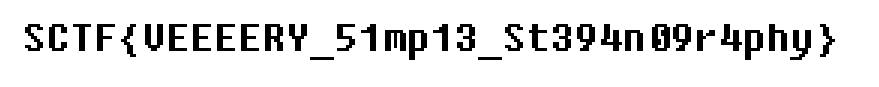

# MyStego

**Category:** Coding

**Points:** 50

**Author:** matta

**Description:** 

> Come on, it's just a simple code.
> 
> Download: [MyStego.zip](resource/MyStego.zip)
> 
> References:
>  1) [OCaml Syntax](https://ocaml.org/learn/tutorials/structure_of_ocaml_programs.ko.html) ... maybe TMI
>  2) Good description for [Python PIllow](https://www.hackingtutorials.org/networking/hacking-netcat-part-2-bind-reverse-shells/)

## Write-up

압축을 풀어보면 ml 코드 하나와 이미지 파일 하나를 얻을 수 있다. 이미지 파일은 열어봐도 뭐 별다른게 보이지 않으니 ml 코드를 먼저 살펴보자.

ml의 문법은 좀 낯설지만 일단 대충이라도 한번 들여다 보자. ~~뭐 잘은 모르겠지만 이것도 사람이 코딩하라고 만든 언어 아니겠는가~~

일단, class 선언 부분은 잠시 건너뛰고, 그 다음을 보면,

```ocaml
if Array.length Sys.argv < 4 then
	(Printf.printf "Usage: %s [input file] [output file] [file to embed]\n" Sys.argv.(0); exit 0);;
```

argv1은 입력 파일, argv2는 출력파일, argv3은 숨길 파일이라고 한다. argv1 + argv3 => argv2가 되는 형태인 것 같다. 문제에서 주어진 이미지는 아마 출력 파일일 것이고, 거기서 숨겨진 데이터를 복구해내는 문제인 것 같다.

```ocaml
let df = new data_feeder;;
df#fopen(Sys.argv.(3));;
let file = Sys.argv.(1) in
let imgdata = OImages.load file [] in
let format, _ = Images.file_format file in
let img =
	match OImages.tag imgdata with
	| Rgb24 img -> print_endline "Rgb24"; img
	| Index8 img -> print_endline "Index8"; img#to_rgb24
	| _ -> print_endline "Not supported input file"; assert false
in
```

data_feeder 클래스의 인스턴스인 df를 만들어서 argv3을 열도록 하고, argv1은 imagedata라는 이름으로 열었다.

imagedata가 Rgv24 또는 Index8이 아니면 오류를 출력하고 종료하는 것 같은데, 정상적으로 생성된 파일을 주었을 테니 오류처리 구문은 무시하고 넘어가자.

```ocaml
Printf.printf "image width: %d\n" img#width;
Printf.printf "image height: %d\n" img#height;
for y = 0 to img#height - 1 do
	for x = 0 to img#width - 1 do
		let color = img#get x y in
		let r = color.r - (color.r land 1) + ((color.g lxor color.b lxor df#fread) land 1) in
		img#set x y {r=r;g=color.g;b=color.b}
	done;
done;
img#save Sys.argv.(2) (Some format) [Save_Quality 100];
print_endline "Save done"
```

이미지의 가로와 세로 크기를 출력하는 구문인데, **img#width**와 **img#height**를 사용하는 걸 보면 img라는 변수에 argv1 이미지에 대한 정보가 저장되는 것 같다.

x,y를 이용해서 hegith와 width만큼 loop을 돈다는 것은 이미지의 각 픽셀로 뭔가를 하겠다는 말이다.

color이라는 변수에 img의 x, y 픽셀의 정보를 저장하는 것 같다.

land가 뭔지 잘 모르겠는데, lxor라는게 뒤에 또 나오는걸 보면 그냥 logical and와 logical xor를 각각 가리키는 말일 것 같다.

color가 한 픽셀의 정보를 가리킨다고 생각하면, color.r - (color.r land 1)을 이용해서 color.r의 마지막 bit을 0으로 만들어 주고, (color.g lxor color.b lxor df#fread) land 1의 결과로 다시 채워주는 것임을 알 수 있다.

data_feeder 클래스의 fread가 어떤 역할을 하는지는 data_feeder 클래스의 코드를 살펴봐야 알겠지만, 각 픽셀의 마지막 1 bit을 다루는 것으로 보아 아마 파일에서 한 bit씩 순서대로 가져오는 역할을 할 것으로 예상해 볼 수 있다.  
(일단 이렇게 생각하고, 나중에 결과가 안나오면 다시 data_feeder 클래스를 살펴보자.)

loop이 끝나면 argv2에다가 img를 저장하고 프로그램이 종료된다.

이제 주어진 이미지(argv2)에서 argv3을 복구해보자.

대부분의 프로그래밍 언어에서 이미지를 다루는 라이브러리를 제공하는데, 일단 힌트에서 python pillow를 언급해 줬으니 Python을 이용해 보았다. ([코드](resource/ex.py))

```python
from PIL import Image
import numpy as np

image = Image.open('challenge.png')

r, g, b = map(np.array, image.split())

binstr = "0b"
for a, b, c in zip(r, g, b):
	for i in range(0, image.width):
		binstr += str(int(a[i] ^ b[i] ^ c[i]) & 1)

with open("out", "wb") as f:
	f.write(("%x"%eval(binstr)).decode("hex"))
```

python과 numpy를 이용해서 이미지의 pixel 정보를 얻어오는 예제는 쉽게 찾을 수 있어서 참고하여 코드를 작성하였다.

주어진 파일을 열고 이미지의 r/g/b 채널을 각각의 array로 분리하고 각 픽셀의 r, g ,b 값을 xor하여 마지막 bit을 모았다.

(image는 2차원 배열이라 r, g, b도 각각 2차원 배열이고, 그래서 i loop을 한번 더 돌아야 각 pixel을 볼 수 있다.)

이렇게 모은 bit string을 파일에 기록하였다.

생성된 파일은 bitmap 이미지 파일로 확인되었고, 열어서 flag를 얻을 수 있었다.


