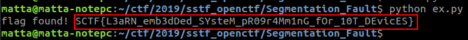

# Segmentation Fault

**Category:** Coding

**Points:** 100

**Author:** matta

**Description:** 

> I tried to show you the flag with my custom 16-segment LED display,  
> but I lost the circuit diagram.
> 
> Can you draw one for me and get the flag?
> 
> Here's a program to printout the flag.
> 
> Download: [Segmentation_Falut.zip](resource/Segmentation_Fault.zip)
> 
> Hint:
>  1) there's no '5'.
>  2) pin 2\~18(2\~13 and A0\~A4) is used because pin 0/1 are used for Serial comm.
>  3) CA(Common anode)

## Write-up

주어진 python 코드를 보면, 먼저 arduino에 연결해서 initialize를 하고 Mapping을 입력받은 다음 mapping에 따라 LED를 제어하는 것을 알 수 있다.

문제에서 16-segment LED라고 했으므로, 16-segment LED에 대해서 좀 찾아보면 숫자 뒤에 마침표까지 17개의 LED를 개별적으로 제어하는 것을 알 수 있다.  
(arduino_test.py 파일을 보면 각 PIN에 대한 데이터 중 11번째 값은 항상 1인데 아마 이게 마침표에 해당하는 핀일 것 같다. 보통 1이면 켜짐 상태라고 생각하기 쉽지만, 힌트에서 알려준 CA(Common Anode)는 17개의 LED 중 + 단자가 공통이란 얘기라서 0을 assign 해줘야 전위차가 생겨서 LED가 점등된다.)

```python
while True:
	seg = [1] * 17

	for v in disp_vector:
		for i in v:
			seg[i] = 1 - seg[i]

		for (idx, val) in zip(list(range(17)), seg):
			board.digital_write(mapping[idx], val)
		time.sleep(1)
```

challenge.py의 코드를 살펴보면, seg라는 리스트가 각 PIN 들의 상태를 저장하고 있다가 dist_vector에 따라 이전의 상태에서 변경되는 PIN만 flip 해주고 있는 것을 알 수 있다.

정확한 mapping을 알기 위해서는 다음과 같은 단서들을 활용해야 한다.

  * 11번째 PIN은 항상 1이다.
  * 출력되는 문자는 "SCTF{"로 시작하여 "}"로 종료된다.

위와 같은 가정을 이용해서 각 PIN의 배열을 찾아 보자.

17개의 LED에 각각 'A' 부터 'Q' 까지의 label을 부여한 후 위의 가정을 만족하는 경우의 수만 따져보면, 2 * 2 * 2 * 2 * 2 * 3 = 96 가지 경우의 수로 mapping을 압축할 수 있다.

(예를 들면, set(S)를 S를 표시하기 위해 점등되는 PIN들의 집합이라고 정의했을 때 <em>(set(S) - set\(C\)) ∩ set(F)</em> 를 이용해서 하나의 PIN에 대한 mapping을 특정할 수 있다.)

모든 경우의 수에 따라 PIN을 배열해보고 이에 따라 점등되는 LED들을 확인해 보면 arduino_test.py에 존재하는 배치만으로 구성된 한 가지의 경우를 찾을 수 있다. ([코드](resource/ex.py))


