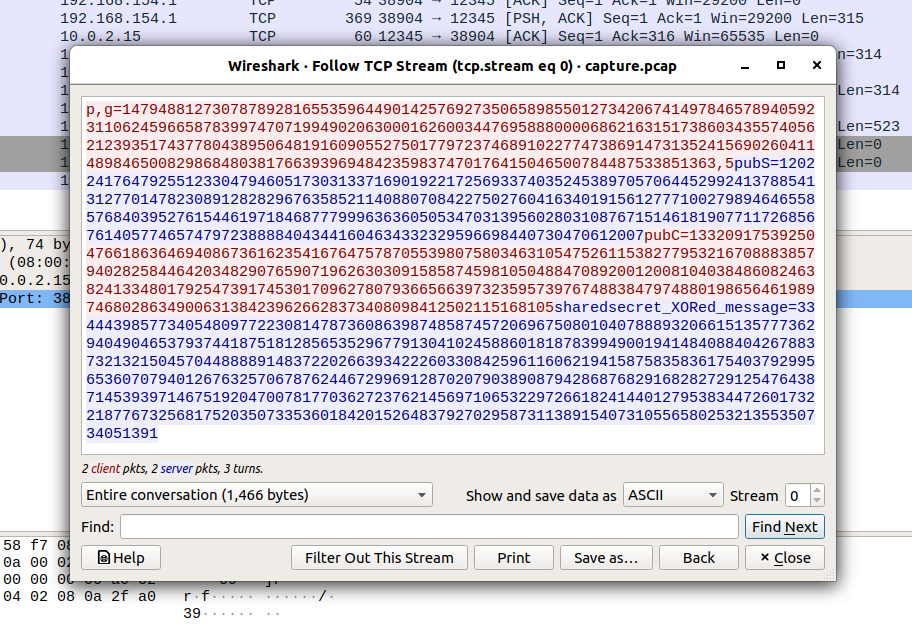
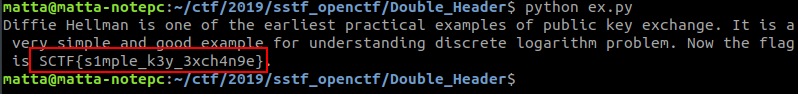

# Double Header

**Category:** Crypto

**Points:** 50

**Author:** matta

**Description:** 

> What does DH means in Cryptography?  
> Can you see the secret message from the server?
> 
> Download: [Double_Header.zip](resource/Double_Header.zip)
> 
> References:
>  1) [Diffie-Hellman Key Exchange Algorithm](https://en.wikipedia.org/wiki/Diffie%E2%80%93Hellman_key_exchange)

## Write-up

암호학에서 DH가 뭐냐고 물어보는데, 힌트에서 Diffie-Hellman이라고 알려준다.

DH에 대해 간단히 살펴보면, A와 B가 각각의 key 쌍을 만든 후 public key만 서로 공유하여 남들은 알 수 없는 Shared Secret 값을 만드는 알고리즘이라고 한다.

문제에서 pcap 파일을 주는데, pcap 파일은 네트워크 통신 패킷을 캡쳐한 파일로 wireshark 등의 도구를 이용하여 열어볼 수 있다.

Wireshark로 pcap 파일을 열어보면 raw data이기 때문에 통신 내용을 한눈에 알아보기는 어렵지만, Follow - TCP Stream 메뉴를 이용하면 통신 내용을 한눈에 알아볼 수 있다.



통신 내용을 보면, diffie-hellman 알고리즘에 맞춰 p와 q값을 전송하고, public key를 서로 공유한 다음, sharedsecret과 XOR한 메세지를 전달하는 것을 알 수 있다.

문제에서 주어진 또다른 파일인 client_params.dat를 살펴보면 client 측의 private key까지 확인할 수 있으므로, 이 통신의 결과로 양방이 생성하였을 shared secret을 계산해낼 수 있고, 이 shared secret을 이용하면 서버가 전송한 암호문을 복호화 할 수 있을 것 같다.

shared secret은 <em>pubS<sup>privC</sup> mod p</em> 또는 <em>pubC<sup>privS</sup> mod p</em> 의 식으로 계산 되는데, python에서는 pow() 함수를 이용하면 쉽게 계산할 수 있다. ([코드](resource/ex.py))

```python
#we can get these values from pcap file
pubS=120224176479255123304794605173031337169019221725693374035245389705706445299241378854131277014782308912828296763585211408807084227502760416340191561277710027989464655857684039527615446197184687779996363605053470313956028031087671514618190771172685676140577465747972388884043441604634332329596698440730470612007
sharedsecret_XORed_message=3344439857734054809772230814787360863987485874572069675080104078889320661513577736294049046537937441875181285653529677913041024588601818783994900194148408840426788373213215045704488889148372202663934222603308425961160621941587583583617540379299565360707940126763257067876244672996912870207903890879428687682916828272912547643871453939714675192047007817703627237621456971065322972661824144012795383447260173221877673256817520350733536018420152648379270295873113891540731055658025321355350734051391

#get parameter values
param = open("client_params.dat").read().strip()
exec(param)

#calculate shared secret
sharedsecret = pow(pubS, privC, p)

#get message
message = sharedsecret_XORed_message ^ sharedsecret
print hex(message)[2:-1].decode("hex")
```

shared secret을 얻고 나면 쉽게 flag를 확인할 수 있다.


