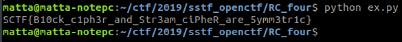

# RC four

**Category:** Crypto

**Points:** 50

**Author:** matta

**Description:** 

> See, decrypt, submit.
> 
> Download: [RC_four.zip](resource/RC_four.zip)
> 
> References:
>  1) [RC4(ARC4)](https://www.geeksforgeeks.org/rc4-encryption-algorithm/)

## Write-up

압축을 풀어보면 challenge.py와 output.txt를 찾을 수 있다.

먼저, python 코드를 살펴보자.

```python
from Crypto.Cipher import ARC4
from secret import key, flag

#RC4 encrypt function with "key" variable.
def encrypt(data):
	#check the key is long enough
	assert(len(key) > 128)

	#make RC4 instance
	cipher = ARC4.new(key)

	#We don't use the first 1024 bytes from the key stream.
	#Actually this is not important for this challenge. Just ignore.
	cipher.encrypt("0"*1024)

	#encrypt given data, and return it.
	return cipher.encrypt(data)

msg = "RC4 is a Stream Cipher, which is very simple and fast."

print encrypt(msg).encode("hex")
print encrypt(flag).encode("hex")
```

encrypt() 함수가 정의되어 있고, msg와 flag에 대한 암호문을 출력하도록 하고 있는데, key와 flag는 ~~당연히~~ 주어져있지 않았으나, msg의 정의는 포함되어 있다.

encrypt() 함수에서는 그냥 key를 이용해서 데이터를 RC4 암호화하여 돌려주는 역할만 하는 것 같다.

문제 제목이 RC four이고 힌트도 RC4로 주어져있으니, 일단 RC4의 동작 구조를 한번 살펴보자.

힌트로 주어진 site의 내용을 보면, RC4는 key를 이용하여 key stream을 만들고 이것을 평문 또는 암호문과 xor 하여 암호문 또는 평문을 만든다고 한다.


A xor B = C 일 때 A xor C = B 라는 xor의 성질을 이용한 것인데, 문제에서 msg와 msg에 대한 암호문이 주어졌으므로 이 둘을 xor 하면 key stream을 복구해낼 수 낼 수 있을 것이다.

msg와 flag를 암호화하는데 동일한 key가 사용되었으므로, 복구한 key stream과 flag에 대한 암호문을 xor 하면 flag를 다시 얻어낼 수 있다. ([코드](resource/ex.py))

```python
a, b = open("output.txt").read().strip().split("\n")
msg = "RC4 is a Stream Cipher, which is very simple and fast."

a = a.decode("hex")
b = b.decode("hex")

l = min(len(a), len(b))
r = ""
for (c1, c2, c3) in zip(a[:l], b[:l], msg[:l]):
	r += chr(ord(c1) ^ ord(c2) ^ ord(c3))
print r
```


