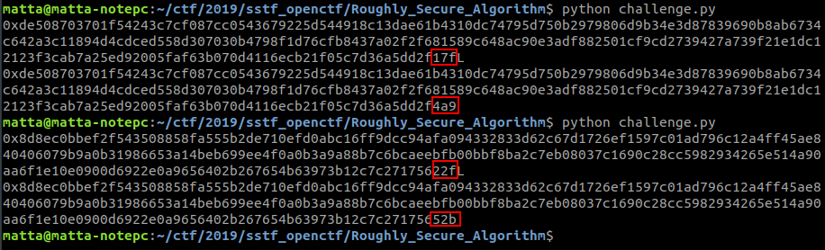
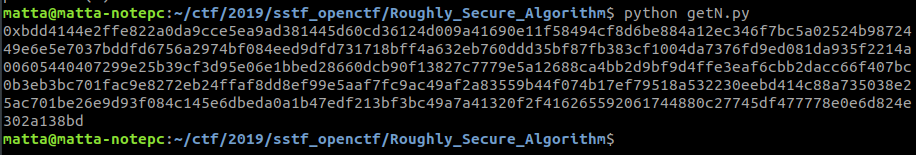
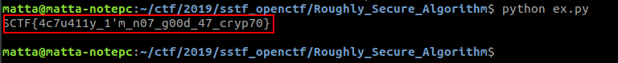

# Roughlt Secure Algorithm

**Category:** Crypto

**Points:** 100

**Author:** matta

**Description:** 

> Crypto is hard? well...
> 
> Download: [Roughly_Secure_Algorithm.zip](resource/Roughly_Secure_Algorithm.zip)

## Write-up

ciphertext.txt는 출력파일일테니, 주어진 py파일에 집중하자.

문제 이름에서도 알 수 있듯 RSA 관련 문제이다.

```python
p = getPrime(1024)
q = gmpy2.next_prime(p)
e = 65537
N = p * q
phiN = (p - 1) * (q - 1)
d = gmpy2.powmod(e, -1, phiN)
```

RSA 알고리즘에 맞춰 parameter를 생성하는데, 원래 알고리즘은 p와 q를 독립적인 prime number로 선택하도록 하고 있지만, 여기서는 p의 next prime을 q로 사용하고 있다.

```python
from Crypto.Util.number import *
import gmpy2

p = getPrime(1024)
q = gmpy2.next_prime(p)

print hex(p)
print hex(q)

exit()
```



문제 파일을 로컬에서 실행시키면서 p와 q를 출력해보면 128byte의 값 중에 마지막 1\~2 byte만 서로 다른 것을 확인할 수 있다. 이 부분은 써먹을 수 있을 것 같으니 keep 해두자.

```python
messages = ["Do U know RSA?", "The format of flag is: SCTF{}", flag]

def encrypt(m):
	msg = bytes_to_long(m)
	ct = gmpy2.powmod(msg, e, N)
	ct = long_to_bytes(ct)
	return ct.encode("hex")

open("ciphertext.txt", "w").write(", ".join(map(encrypt, messages)))
```

생성한 RSA 파리미터를 이용하여 세 가지 메세지를 암호화 하는데, 두 가지는 코드에 적혀있고 마지막 메세지가 flag이다.

코드는 암호화된 메세지 3개를 출력해주고 종료되는데 문제에서 주어진 ciphertext.txt 파일이 여기서 출력된 결과인 것 같다.

RSA는 인수분해의 어려움에 기반한 알고리즘으로 N의 값을 인수분해하여 p와 q를 얻으면 공격에 성공할 수 있지만, 여기서는 N 값 자체가 주어지지 않았다.

N을 먼저 구해보자.

암호화의 대상인 평문 세개를 <em>m<sub>1</sub>, m<sub>2</sub>, m<sub>3</sub></em>라고 하자.

암호문 <em>c<sub>1</sub>, c<sub>2</sub></em>는 각각 <em>c<sub>1</sub> = m<sub>1</sub><sup>e</sup> mod N, c<sub>2</sub> = m<sub>2</sub><sup>e</sup> mod N</em>으로 계산된 값이다.

<em>m<sub>1</sub><sup>e</sup> - c<sub>1</sub> = 0 mod N</em>이므로, <em>m<sub>1</sub><sup>e</sup> - c<sub>1</sub></em>은 N의 배수이다.

마찬가지로, <em>m<sub>2</sub><sup>e</sup> - c<sub>2</sub></em> 역시 N의 배수이다.

그러므로, 이 둘의 공약수 또한 N의 배수가 될 것이다. 공약수를 먼저 구해보자.

```python
from Crypto.Util.number import *
import gmpy2

e = 65537
ct = [bytes_to_long(c.decode("hex")) for c in open("ciphertext.txt").read().split(", ")]
pt = map(bytes_to_long, ["Do U know RSA?", "The format of flag is: SCTF{}"])

k1N = pow(pt[0], e) - ct[0]
k2N = pow(pt[1], e) - ct[1]

N = gmpy2.gcd(k1N, k2N)

assert(gmpy2.powmod(pt[0], e, N) == ct[0])
assert(gmpy2.powmod(pt[1], e, N) == ct[1])
print hex(N)
```



로컬에서 p, q를 직접 생성시켜가며 테스트를 해보면 N이 한번에 얻어지는게 아니라, 원래 N에 작은 수(100 이하의)가 곱해진 값이 구해질 때도 있는데(이런 경우 간단한 brute force를 통해 N을 찾을 수 있다.), 문제에서 주어진 파라미터들로는 그런거 없이 한번에 N을 찾을 수 있다.

N을 찾았으니 이제 p, q만 찾으면 문제를 해결할 수 있을 것 같다.

p와 q는 아주 큰 수라서, 하위 1\~2 byte 정도 차이는 상대적으로 작은 부분이라고 볼 수 있다. 그러니 p ≈ q라고 쓰자.

<em>N = pq ≈ p<sup>2</sup></em>이므로, <em>sqrt(N) ≈ p</em>이라고 쓸 수 있다.(<em>sqrt()</em>는 squre root 함수)

p와 q 중에 하나는 <em>sqrt(N)</em> 보다 크고 하나는 작을 것인데, 우리 입장에서는 p 또는 q 중에하나만 알면 되니 <em>sqrt(N)</em> 부터 시작해서 brute force를 시도하면 금방 N의 약수를 찾을 수 있을 것이다.

N의 약수 하나(편의상 p 라고 하자)를 찾으면 N으로 나누어 q를 계산할 수 있다. p와 q를 알게 되면 문제 코드 처음에 써있던 대로 비밀키 d를 구할 수 있고, flag를 복호화 할 수 있게 된다. ([코드](resource/ex.py))



참고로, 아래 식을 이용하여 N으로부터 바로 phi(N)을 구할 수도 있다.

<em>phiN = (p - 1)(q - 1) = pq - (p + q) + 1 = N - (p + q) + 1 ≈ N - 2(ceil(sqrt(N))) + 1</em>

이 문제에서 처럼 p와 q의 차이가 매우 작은 경우에 p + q = 2 * ceil(sqrt(N))이 성립하므로, <em>N - 2(ceil(sqrt(N))) + 1 = phiN</em>으로 쓸 수 있다.
