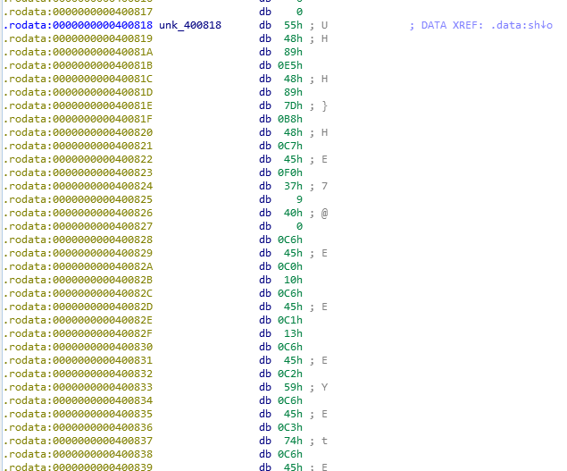

# AsmReader

**Category:** Reversing

**Points:** 50

**Author:** matta

**Description:** 

> Can you understand assembly?
> 
> Download: [AsmReader.zip](resource/AsmReader.zip)
> 
> References:
>  1) [Intel X86 Instructions](https://www.felixcloutier.com/x86/)

## Write-up

다운로드한 압축파일을 풀어보면 실행파일 하나를 얻을 수 있다. 실행시켜보면 아무것도 안나오는데, 대충 아무 문자열이나 넣어보면 **Wrong Input.**이라는 출력과 함께 그냥 종료된다.

IDA를 이용해서 decompile을 해보자.

```c
int __cdecl main(int argc, const char **argv, const char **envp)
{
  char *v3; // rsi
  signed int i; // [rsp+4h] [rbp-3Ch]
  void *dest; // [rsp+8h] [rbp-38h]
  char v7[40]; // [rsp+10h] [rbp-30h]
  unsigned __int64 v8; // [rsp+38h] [rbp-8h]

  v8 = __readfsqword(0x28u);
  dest = mmap(0LL, 0x200uLL, 7, 34, -1, 0LL);
  v3 = (char *)sh;
  memcpy(dest, sh, 0x11EuLL);
  for ( i = 0; i <= 6; ++i )
  {
    v3 = &v7[4 * i];
    __isoc99_scanf(&unk_400954, v3);
  }
  if ( ((unsigned int (__fastcall *)(char *, char *))dest)(v7, v3) )
    printf("Congrats! The flag is: SCTF{%s}\n", v7);
  else
    printf("Wrong Input.");
  return 0;
}
```

코드를 보면 Read/Write/Executable 모두 가능한 메모리를 할당하고, sh를 복사해 넣는다.

그러고 나서 7개의 숫자를 입력받는데(unk_400954는 "%d"라는 문자열을 가리킨다.), 입력받은 숫자들을 argument로 하여 sh를 복사해넣은 메모리에 있는 함수를 호출한다.

이걸로 봐서, sh는 정수 배열을 인자로 받아 true/false를 리턴하는 함수가 shellcode 형태로 표현된 것임을 유추할 수 있다.

sh에는 어떤 값이 들어있는지 확인해보자.



IDA는 sh를 데이터로 간주했기 때문에 데이터 형식으로 보여준다. 우리는 이 값이 사실은 instruction code라는 것을 알고 있으므로, 이 데이터를 x64 instruction에 맞추어 해석하면 된다.

두 가지 방법이 있을 수 있는데, 하나는 x64 instruction spec을 보면서 opcode와 arg 들을 열심히 해석하는 것이고, 다른 하나는 도구의 힘을 빌리는 것이다.

손으로 해보는 분석은 assembly를 읽는 스킬을 기르는데 큰 도움이 되므로 적극적으로 권장할만 하지만 그러면 별로 writeup에 쓸 말이 없으므로 이왕 IDA를 열어둔 김에 이를 이용하도록 한다.

sh의 데이터 영역의 시작 부분에 커서를 갖다두고 'c'키를 눌러서 IDA에게 해당 data block이 코드 영역임을 알려주자.


이정도만 되어도 읽기가 훨씬 편하다. 하지만 문명의 이기는 여기서 그치지 않는다.

이번엔 'p'키를 눌러서 이 instruction들이 사실은 함수라는 것도 알려주면 붉은 색으로 표시되었던 주소들이 검은색으로 바뀌면서 instruction들이 좀 더 읽기 편하게 정리된다.


IDA가 sh를 정상적인 함수로 인식하게 되었으니 이제 'F5' 키를 눌러 decompile까지 시켜보자.


sh 함수는 크게 두 부분으로 나눌 수 있는데, 하나는 char 배열을 초기화 하는 부분이고 나머지 부분은 입력값을 체크하고 flag를 만드는 부분이다.

flag는 입력값에 기반하여 만들어지도록 되어 있으니 입력값 검사를 통과할 수 있는 값을 찾아보자.

입력값 검사는 각 byte a[i]에 대해 ((a[i] + 79) * 31337) % 127이 "Reading bytecode is not easy"의 i번째 문자와 동일한지 확인하고 있다.

이 검사식에 대한 역함수를 구하고, 코드에 있는 것과 동일한 방법으로 flag를 만들어보자. ([코드](resource/ex.py))

```python
import gmpy2

arr = "Reading bytecode is not easy"
mask = [16, 19, 89, 116, 98, 92, 109, 14, 7, 50, 53, 116, 24, 63, 108, 98, 121, 72, 12, 68, 119, 77, 9, 13, 67, 4, 81, 105]

a = 31337
b = 79
m = 127

ainv = int(gmpy2.powmod(a, -1, m))
s = []
f = []
for i in range(len(arr)):
	s.append((ord(arr[i]) - b) * ainv % m)
	f.append(chr(s[-1] ^ mask[i]))

print "SCTF{" + "".join(f) + "}"

print "\nRight answers are:"
for i in range(0, len(arr), 4):
	t = map(chr, s[i:i + 4][::-1])
	print int("".join(t).encode("hex"), 16)
```

modular 연산에서 31337의 127에 대한 곱셈의 역원을 구하는 방법을 사용했는데, 어차피 printable ascii만을 사용할테니 그냥 brute force해도 상관은 없을 것 같다.

위 코드를 실행해보면 flag와 문제에서 원했던 입력값을 확인할 수 있다.

