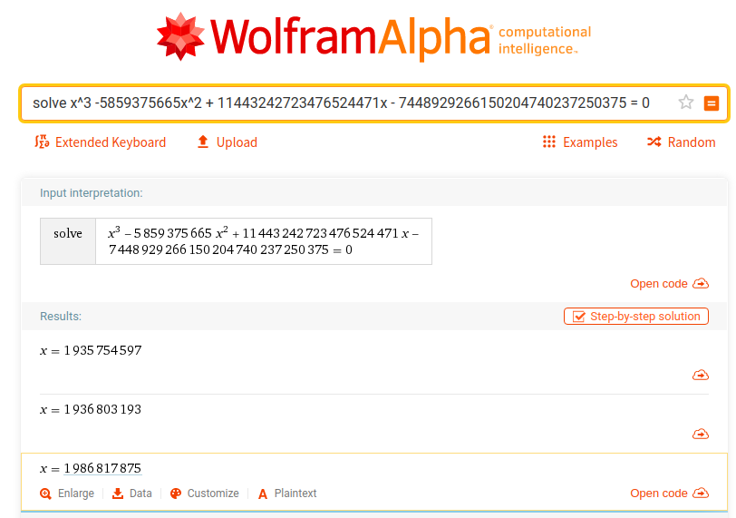
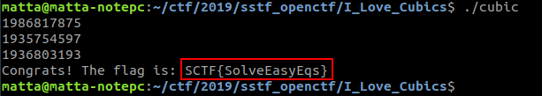

# I Love Cubics

**Category:** Reversing

**Points:** 100

**Author:** matta

**Description:** 

> I love bling bling cubics.
>
> Download: [I_Love_Cubics.zip](resource/I_Love_Cubics.zip)

## Write-up

Binary 파일 하나가 주어지는데, 실행시켜보면 대충 숫자 세개를 입력받는 것 같다.

Decompile을 해보자.

```c
int __cdecl main(int argc, const char **argv, const char **envp)
{
  int result; // eax
  unsigned __int64 *v4; // rdx
  unsigned __int64 v5; // rcx
  unsigned __int128 v6; // ax
  signed int i; // [rsp+8h] [rbp-58h]
  signed int j; // [rsp+8h] [rbp-58h]
  signed int k; // [rsp+Ch] [rbp-54h]
  __int128 v10; // [rsp+10h] [rbp-50h]
  __int128 v11; // [rsp+20h] [rbp-40h]
  __int64 v12; // [rsp+30h] [rbp-30h]
  __int64 v13; // [rsp+38h] [rbp-28h]
  unsigned __int64 v14; // [rsp+48h] [rbp-18h]

  v14 = __readfsqword(0x28u);
  v12 = 0LL;
  v13 = 0LL;
  for ( i = 0; i <= 2; ++i )
  {
    argv = (const char **)((char *)&v12 + 4 * i);
    __isoc99_scanf(&unk_A38, argv);
  }
  if ( SHIDWORD(v12) < (signed int)v13 && (signed int)v13 < (signed int)v12 )
  {
    for ( j = 0; j <= 2; ++j )
    {
      v10 = (signed int)getval(*((_DWORD *)&v12 + j));
      v11 = 0uLL;
      for ( k = 0; k <= 2; ++k )
      {
        v4 = (unsigned __int64 *)&::k[k];
        v5 = v4[1] * v10 + *v4 * *((_QWORD *)&v10 + 1);
        v6 = (unsigned __int64)v10 * (unsigned __int128)*v4;
        *((_QWORD *)&v6 + 1) += v5;
        v11 += v6;
        v10 *= *((signed int *)&v12 + j);
      }
      if ( (v11 ^ ::k[k]) != 0 )
      {
        printf("Wrong Input.");
        return -1;
      }
    }
    printf("Congrats! The flag is: SCTF{%s}\n", &v12);
    result = 0;
  }
  else
  {
    printf("Wrong Input.", argv);
    result = -1;
  }
  return result;
}
```

scanf에서 "%d"로 입력 받고 있으니 내가 입력한 값들은 v12와 v13에 4byte씩 쪼개져서 들어가는 것 같다.

j loop을 돌면서 입력값 세 개에 대해 테스트를 하는데 이 부분을 좀 더 자세히 살펴보자.

getVal() 함수에 대한 분석은 여기서는 쓰지 않겠지만, 확인해보면 <em>getVal(x) = x</em>인 id함수이다.

실행에 아무 영향이 없는 getVal 함수는 static analysis를 방해하기 위한 목적으로 삽입되었는데, 이게 없으면 angr 등을 이용해서 쉽게 입력값을 찾을 수 있기 때문이다.

v4는 k 배열의 k번째 값이고, ~~IDA가 헷갈리게.. 똑같은 k라고 이름을 붙였다~~ v6 = v10 * v4 이다.  
(128bit integer의 곱셈인데 x64에서는 64bit integer(QWORD) 두 개로 쪼개서 계산하기 때문에 임시 변수로 v5가 사용되었다.)

k에 대한 for문은 128bit integer 변수인 v10과 v11에 대해서 아래와 같은 계산을 수행하는 것으로 정리될 수 있다.

  * v11 += v10 * k[k]  //(k[k]에서 앞의 k(전역)와 뒤의 k(지역)는 다른 변수)
  * v12 \*= (j번째 입력값)

j번째 입력값을 x라고 하고, k loop 안에서 v11이 어떻게 정리되는지 살펴보자.

| k  | v11           | v10           |
|:--:|:-------------:|:-------------:|
|init| <em>0</em>    | <em>x</em>    |
| 0  | <em>k[0] * x</em> | <em>x<sup>2</sup></em> |
| 1  | <em>k[1] * x<sup>2</sup> + k[0] * x</em> | <em>x<sup>3</sup></em> |
| 2  | <em>k[2] * x<sup>3</sup> + k[1] * x<sup>2</sup> + k[0] * x</em> | <em>x<sup>4</sup></em> | <em>x<sup>4</sup></em>

위와 같이 loop이 돌고 나서 v11과 k[3]의 값이 동일한지 확인한다.

즉, 입력받은 정수 값이 <em>k[2] * x<sup>3</sup> + k[1] * x<sup>2</sup> + k[0] * x - k[3] = 0</em>의 해인지 확인하는 것이다.

k 배열의 값은 gdb를 돌려서 xmm 레지스터의 값을 확인해도 되고, IDA에서 hex 형태로 된 값을 확인해도 되는데, 그 값은 아래와 같다.

| index | value(decimal) | value(hex) |
|:-----:|:-----:|:----------:|
| 0     | 11443242723476524471 | 0x00000000000000009ece90a0cb644db7 |
| 1     | -5859375665 | 0xFFFFFFFFFFFFFFFFFFFFFFFEA2C105CF |
| 2     | 1 | 0x00000000000000000000000000000001 |
| 3     | 7448929266150204740237250375 | 0x0000000018119C20A70D35A741F3CF47 |

<em>x<sup>3</sup> -5859375665x<sup>2</sup> + 11443242723476524471x - 7448929266150204740237250375 = 0</em> 의 해를 구해보자.

3차 방정식 까지는 근의 공식이 나와있지만, 역시나 도구의 힘을 빌리는게 편하다.

[울프람 알파](https://www.wolframalpha.com/)에게 방정식을 던져주었더니 금방 해를 구해주었다.



1935754597, 1936803193, 1986817875 이렇게 세 개의 해를 얻었는데 입력 직후의 if문을 통과하려면 1986817875, 1935754597, 1936803193의 순서로 입력해줘야 한다.


