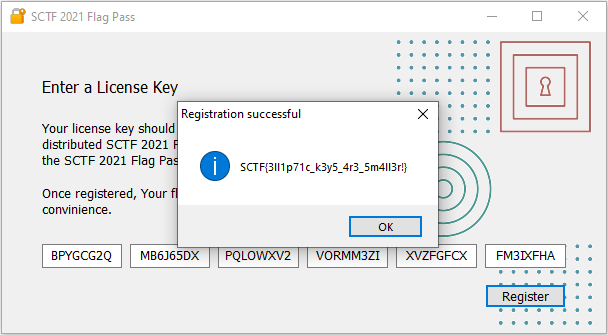

License Writeup
===

##### Target:
> 423a58b5688829205464293369cf4ea6  SCTF2021FlagPass.exe

##### Exploitation:

#### 1. Testing

Program asks for a 48-length license key to generate a flag. 
We are given two license keys:
```
BHAWBGQ5-MB4IUR5V-26YFXZSW-MSHEVTDN-GZB4ED2N-KDHX7A5I
BJUWBPYH-MCVFRYIZ-ZV45N5EU-D5HL6K6H-6N4VCS6X-BIUQSUTR
```

Unfortunately, both of them have expired already.


#### 2. Disassemble

Let open exe in disassembler, and search for a string `"Key expired"`. 
We have:


Strings are referenced from function `sub_406310`:


Here we see a MessageBox with caption `"Registration successful"` and title is a conversion 
from 33-char array (lets call it `flag`) to 33-wide-char array `var_60`.

`flag` is an array at offset 0x411B20, lets call it `SECRET`, XORed with 32-length SHA-256 digit of `buffer`.  


While, `buffer` is 30-length array and `chars` is a 48-length concatenation text of TEdit components (6 input fields for license key) on a Windows form - are 
arguments of call `sub_405480`. That, turns out, is a Base32 decoding routine.

#### 3. Constrains

However, there are a few constrains that license key have to be satisfied:
```
buffer[0] ^ buffer[7] == buffer[28]
buffer[1] ^ buffer[3] == buffer[12]
```
Otherwise `"Invalid key"` error occurs:


#### 4. Key instantiation

Then new object of a class (let say `LicenseKey`) with fields size 54 bytes instantiates.


Function `sub_405900` is a constructor that accepts `buffer`.


The first 6 bytes of `buffer` copied to field at offset +0x30, lets name it `data`.
Remaining 24 bytes, converted to hex string and stored into field at offset +0, say `signature`
Thus, can define the following structure:
```C
struct LicenseKey
{
  char signature[48];
  char data[6];
};
```

#### 4. Key verification

Finally, function `sub_405A10` shed light on the license key verification process.


It uses OpenSSL library to instantiate `prime192v1` elliptic curve and setup public key.
Then, `LicenseKey.data` is hashed with SHA-1 and result is verified against provided `LicenseKey.signature` by ECDSA - Elliptic Curve Digital Signature Algorithm.

If verification failed, we have `"Invalid key"` message again.

#### 5. Spot vulnerability

We can spot a vulnerability here. 

ECDSA generates signature as a pair of integers `(r, s)`.
From a disassembly we can clearly see, the first component of the signature `r` is a constant `524142708193906720498422…`, no matter what a license key is.
It indicates, that signing operation used in license key generation algorithm is implemented incorrectly. 
Some constant parameter `k` is been used instead of cryptographically secure random value for each license key. 

That means, we can apply private-key recovery attack given at least two different keys. Likely we have a few keys... 😁

#### 6. Key expiration

Last constrain is key expire time check in function `sub_4059A0`:


Here, license key bytes from 2 to 5 encode as a 32-bit integer timestamp. Then current time in UTC zone compared with the timestamp.

Probably, the first two bytes is a 16-bit integer, like user id, or something.

#### 6. Secret ingredient

We still need to figure out what is `SECRET` array that is XORed to get a flag. 
The second usage of this global variable is function `sub_405D70`:


[WinApi Reference](https://docs.microsoft.com/en-us/windows/win32/api/winver/nf-winver-verqueryvaluea) has an example on 
how to use `GetFileVersionInfoSize`, `GetFileVersionInfo` and `VerQueryValue` functions to retrieve specified version information 
from the specified file.

So, version information stored in `PrivateBuild` is read from the application itself, decoded via Base32 and the 32-bytes result is stored in `SECRET`.

Search for the resource value:


So, `SECRET = b32decode("TSRFHR6JXKTXUL4T4WY4FLPIAEHSXZC7T3FKRGVEVPEVGWBQ6KKQ====")`

Probably, every user has unique `PrivateBuild` info along with a license-key, that is why given keys do not reveal the flag.

#### 7. Putting all together

So far:
* we know license key format; 
* can recover private-key, so can sign arbitrary data;
* create any new valid key, that being XORed with `SECRET` reveals the flag.


###### 7.1. License Key

Basic license key may be represented as a following Python3 class:

```python
class LicenseKey:
    def __init__(self, chars: str):
        x = b32decode(chars.replace("-", ""))
        self.uid = x
        self.expires = x
        self.signature = x

    @property
    def uid(self) -> int:
        return int.from_bytes(self._uid, 'big')

    @uid.setter
    def uid(self, value: int):
        self._uid = value[0:2]

    @property
    def expires(self) -> datetime:
        return datetime.fromtimestamp(int.from_bytes(self._expires, 'big'), tz=timezone.utc)

    @expires.setter
    def expires(self, value: datetime or bytes):
        self._expires = value[2:6]

    @property
    def signature(self) -> int:
        return int.from_bytes(self._signature, 'big')

    @signature.setter
    def signature(self, value: int or bytes):
        self._signature = value[6:]

    @property
    def data(self) -> bytes:
        return self._uid + self._expires
        
    def sign(self, private: int, k: int):
        pass # ToDo
        
    def verify(self, public):
        pass # ToDo

    def valid(self) -> bool:
        return self.quickcheck() and \
               datetime.now(timezone.utc) <= self.expires and \
               self.verify()

    def quickcheck(self) -> bool:
        return self[0] ^ self[7] == self[28] and \
               self[1] ^ self[3] == self[12]

    def __bytes__(self):
        return self.data + self._signature

    def __str__(self):
        s = b32encode(bytes(self)).decode('ascii')
        return "-".join((s[i:i + 8] for i in range(0, len(s), 8)))

    def __getitem__(self, item):
        return bytes(self)[item]

    def __repr__(self):
        return f"{{uid={self.uid}, expires={self.expires}," \
               f" bytes={self._uid.hex()}_{self._expires.hex()}_{self._signature.hex()}" \
               f" valid={self.valid()}}}"
               
               

```

So, given keys:
```python
key1 = LicenseKey("BHAWBGQ5-MB4IUR5V-26YFXZSW-MSHEVTDN-GZB4ED2N-KDHX7A5I")
key2 = LicenseKey("BJUWBPYH-MCVFRYIZ-ZV45N5EU-D5HL6K6H-6N4VCS6X-BIUQSUTR")

print(repr(key1))
print(repr(key2))
```
shows:
```
{
    uid = 2497,
    expires = 2021-05-11 06:00:00+00:00,
    bytes = 09c1_609a1d60_788a47b5d7b05be656648e4acc6d3643c20f4d50cf7f83a8,
    valid = False
}

{
    uid = 2665,
    expires = 2021-06-08 06:00:00+00:00,
    bytes = 0a69_60bf0760_aa58e119cd79d6f4941f4ebf2bc7f379514bd70a29095271,
    valid = False
}
```

The main observation are:
* Expiration time is constant (06:00:00) only date is changing;
* Timestamps and user ids are growing;
* In order to produce a flag, likely, license key have to valid during CTF event (16 Aug. 2021, 06:00 UTC — 17 Aug. 2021, 06:00 UTC);

###### 7.2. Private-key recovery

Let add Elliptic Curves, we can use python library `fastescda` for instance.
From our disassembly we know: curve `prime192v1`, `qx`, `qy`, `R`:

```python
from fastecdsa.curve import P192 as E

Q = Point(
    x=4910017285067243285659645658183706496882752243738091681795,
    y=894613538273475752824630788065081050497548342550540448591,
    curve=E
)

R = 5241427081939067204984227503904086701023032271828334909509
N = E.q
```

Then private-key can be recovered like this:

```python
def attack(s1: int, s2: int, m1: bytes, m2: bytes) -> (int, int):
    def inverse(a: int, b: int) -> int:
        return 0 if a == 0 else 1 if b % a == 0 else b - inverse(b % a, a) * b // a

    h1 = int.from_bytes(sha1(msg_bytes(m1)).digest(), byteorder='big')
    h2 = int.from_bytes(sha1(msg_bytes(m2)).digest(), byteorder='big')

    x = inverse((s1 - s2) % N, N)
    _k = (((h1 - h2) % N) * x) % N
    _r = inverse(R, N)
    _d = (_r * ((((_k * s1) % N) - h1) % N)) % N

    return _k, _d
```

###### 7.3. Generate key

Given observations about the given keys, lets brute force all key generated with uid starting from the largest know id, 
and expiration date backward starting from CTF end date:

```python
def bruteforce(begin: datetime, end: datetime, start: int, finish=9999, delta=timedelta(days=1)):
    now = end
    while now > begin:
        for uid in range(start, finish):
            yield uid, now
        now -= delta
        

for uid, date in bruteforce(
    begin=max(key1.expires, key2.expires),
    end=CTF_END,
    start=max(key1.uid, key2.uid)
):
    key = LicenseKey(uid, date, d, k)
    if key.quickcheck():
        flag = xor(sha256(bytes(key)).digest(), SECRET)

        if flag.startswith(b"SCTF{"):
            print(key)
            print(flag.decode('ascii'))
            break
```


#### 8. PROFIT!
```
BPYGCG2Q-MB6J65DX-PQLOWXV2-VORMM3ZI-XVZFGFCX-FM3IXFHA
SCTF{3ll1p71c_k3y5_4r3_5m4ll3r!}
```


