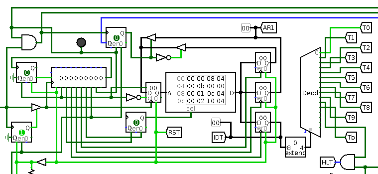

LogicOrDie Writeup
===

##### Target:
> 74400eeedb5ab64109288b66149dbcb5  task.circ

### Solution:
See into the target file
```xml
<?xml version="1.0" encoding="UTF-8" standalone="no"?>
<project source="2.7.1" version="1.0">
  This file is intended to be loaded by Logisim (http://www.cburch.com/logisim/).
  <lib desc="#Wiring" name="0"/>
  <lib desc="#Gates" name="1">
  ...
```
Install [Logisim](http://www.cburch.com/logisim/) and open it.

There is a lot of different logical elements and wires. After reading the program tutorial and after some attempts to start the simulation, we can recognize several units.

#### Unit 1. Virtual machine


This unit contains the ROM component where is stored a program for virtual machine. Each command remains 4 bytes. There first byte is for alignment only. The second byte contains code of command. The next two bytes are arguments of command. In the right side of image we can see decoder which aim is directing logical 1 to block of scheme that executes certain command. Depending of result of command the virtual machine makes transition to addresses in arguments 1 or 2 of command.

#### Unit 2. Input and output


This block is responsible for starting and stopping the program, displaying the result. There is also a ROM component. It should contain some secret sequence of bytes. Because it empty the virtual machine prints ERROR


#### Unit 4. Decryption


On this stage of analysis it seems tasks 7,8,9 are responsible for decryption of some message.

#### Unit 5. Key checking
This unit consists of seven tasks. Let's take a closer look at them. 
There are tunnels `TCL`, `KYE`, `KYA`, `KYD`. These components are connected to the all of our seven tasks. 
The arrival of logical 1 to these components provides certain actions: 
* `TCL` enables execution of task, 
* `KYE` enables working of ROM component with secret key, 
* `KYA` provides access to address register of ROM, 
* `KYD` returns one byte of secret key.

There is also the tunnel `IDT` that is equal to number of task.

##### T0:


Checks 2nd byte of the secret key as follows: `Rol(key[2] ^ 0x34, 5) == 0x98`
```python
>>> b = 0x34 ^ 0x98
>>> hex(((b >> 5) | (b << 3)) & 0xFF)
'0x65'
```

##### T1: 


Provides checking of 3rd byte as follows: `key[3] == ~(1 ^ 0x99)`
```python
>>> hex(~(1 ^ 0x99) & 0xff)
'0x67'
```

##### T2: 


Checks 7th byte of the secret key as follows: `((key[7] >> 3) == 0x0D) and (bitsum(key[7]) == 5)`
As we can see, several values of this byte are possible:
 ```python
>>> [hex(i) for i in range(127) if ((i>>3) == 0b1101) and (bin(i).count('1') == 5)]
['0x6b', '0x6d', '0x6e']
```
We will try these values later.

##### T3: 


Checks 4th byte as follows: `(key[4] - 0xA3 == 0xBE) and (key[4] + 0xA3 == 0x04)`
```python
>>> hex((0x04 - 0xa3) & 0xff)
'0x61'
>>> hex((0xbe + 0xa3) & 0xff)
'0x61'
```

##### T4:


Checks 6th byte as follows: `~(-key[6] ^ 4) == 0x36`
```python
>>> hex(-(~0x36) ^ 4 & 0xFF)
'0x33'
```

##### T5: 


Checks bytes 0, 1, 5 as follows:
```
((key[5] ^ key[0]) + (key[0] ^ key[1]) == 0x6C) and
((key[5] ^ key[0]) - (key[0] ^ key[1]) == 0x0C)
```
These constraints are not enough to solve these values. So, we need to find the value of one of these bytes in the next task.

##### T6: 


Checks 5th byte as follows:
```
for (i = 0; i < 0x7F; i++) {
    if (random(0x2a) == 0x01) {
        if (key[5] == i) return true;
    }
}
```
According to the [Library Reference](http://www.cburch.com/logisim/docs/2.7/en/html/libs/mem/random.html) we know that random works as follows: rₙ = (25214903917 rₙ₋₁ + 11) mod 2⁴⁸

This sequence is of 48-bit numbers; the value seen from the component is the low-order bits as configured by its Data Bits attribute, after first throwing out the lower 12 bits of the current seed.

Let's try to solve it on python:
```python
>>> r = 42
>>> for i in range(1, 128):
...     r = (25214903917 * r + 11) % 281474976710656
...     if ((r >> 12) & 0xFF) == 0x01:
...             print(hex(i))
...             break
... 
0x65
```

#### Back to T5
Now we can find values of bytes 0 and 1
```python
>>> k0 = 0x65 ^ ((0x6C + 0x0C) >> 1)
>>> k1 = (0x6C - (0x65 ^ k0)) ^ k0
>>> hex(k0), hex(k1)
('0x59', '0x69')
```

#### Back to T2
Now we can try all possible secret keys:
```
59 69 65 67 61 65 33 6b
59 69 65 67 61 65 33 6d
59 69 65 67 61 65 33 6e
```

#### PROFIT!
Flag is `SCTF{lOgic_e1em3nt5_maTteRs}`


