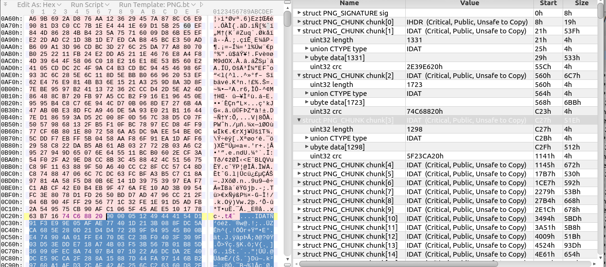

Mars Rover Writeup
===

##### Target:
> 4b120467a75c40009f57befbd482a3f1  task.png

##### Story:
> Some time ago NASA started receiving strange photos from their Mars Rover.

### Solution:
There is an image maked by Mars Perservance Rover. User can find the original image on the NASA website using google:
> [https://mars.nasa.gov/mars2020/multimedia/raw-images/image-of-the-week/week-12](URL)

Comparing the two images, the user should notice that the length of chunks has changed.
Then the user should guess that the CRC of the chunks is important and the information is contained in the lower byte of CRC:

#### PROFIT!
Flag is `SCTF{M4rti@n_wi11_b3_bACk_aT_anY_t1M3}`
