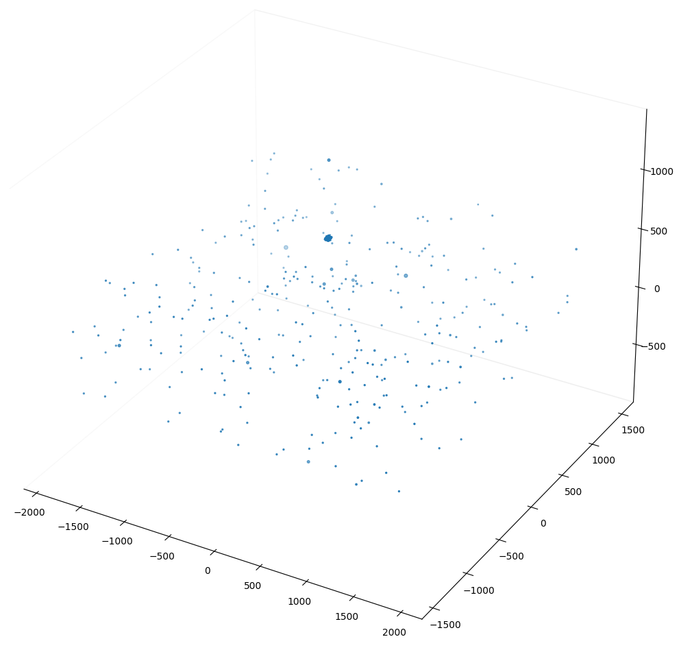
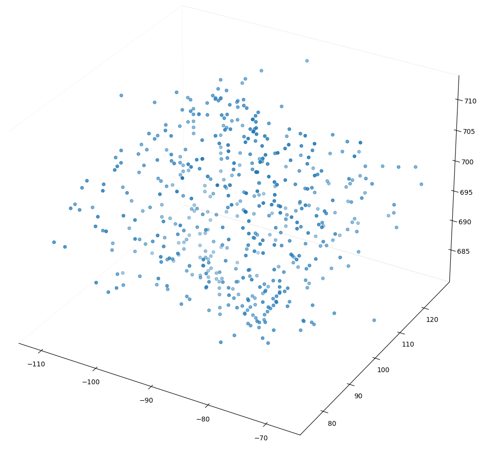
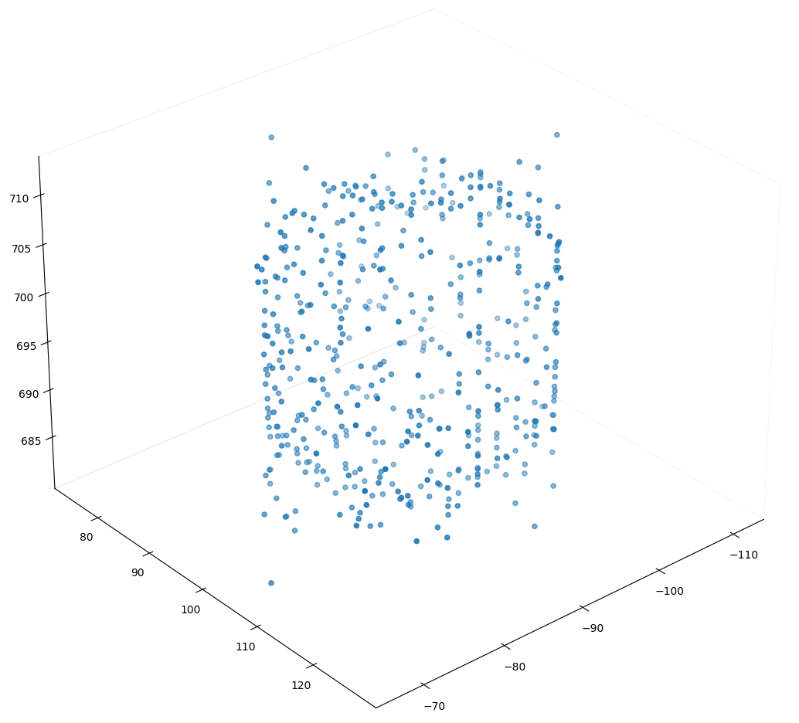
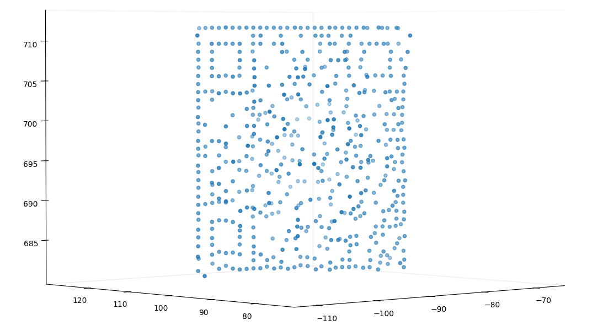
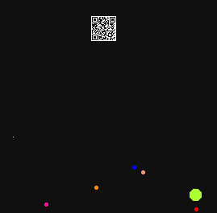

MenInBlackHats Writeup
===

##### Target:
> bd981a63e0e1dc99aae8f3e9164deb43  task.py

##### Story:
> MIB knows that [The Galaxy is on Orion's Belt](https://www.youtube.com/watch?v=aJCCUdK7PiU)

### Solution:
There are an image of a night sky of Orion's consolation with a _galaxy_ in the middle of Orion's belt, 
and a script that contains coordinates of the starts (x, y, z, and radius).

After closer look at the script, we can spot unused functions `rotx`, `roty`, `rotz`.

We can use visualization library for Python [Matplotlib](https://matplotlib.org/) and build 3D model of stars:
```python
from task import st
import matplotlib.pyplot as plt

fig = plt.figure(figsize=(100, 100))
ax = fig.add_subplot(111, projection='3d')

ax.grid(False)
ax.xaxis.pane.fill = False
ax.yaxis.pane.fill = False
ax.zaxis.pane.fill = False

X, Y, Z = [], [], []

for x, y, z, d in st:
    X.append(x)
    Y.append(y)
    Z.append(z)

ax.scatter(X, Y, Z)

plt.show()
```


Let's filter _galaxy_ stars only and look closer:
```python
...
for x, y, z, d in st:
    if d == 0:
        X.append(x)
        Y.append(y)
        Z.append(z)
...
```


Let's play around and rotate them..



.. a bit more ..


As soon as we find right point of view, some QR-code appears.
Then reuse script:
```python
from task import st, drw_stars, rotx, roty, rotz

st = [rotz(p, 36.57) for p in st]
st = [rotx(p, -90) for p in st]

drw_stars(st, "solution.png")
```


#### PROFIT!
Flag is `SCTF{MiB_sh0u1d_t@k3_c4re_0f_my_CAt}`
