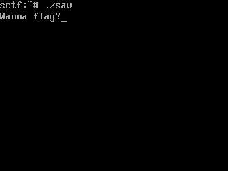
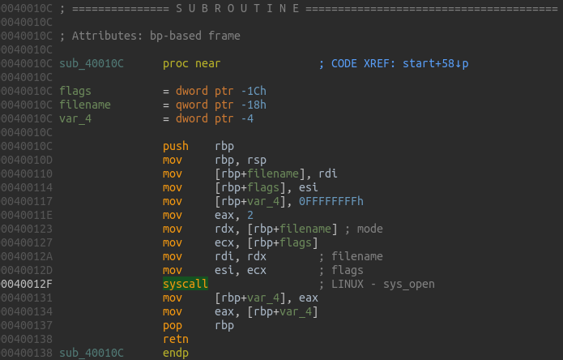
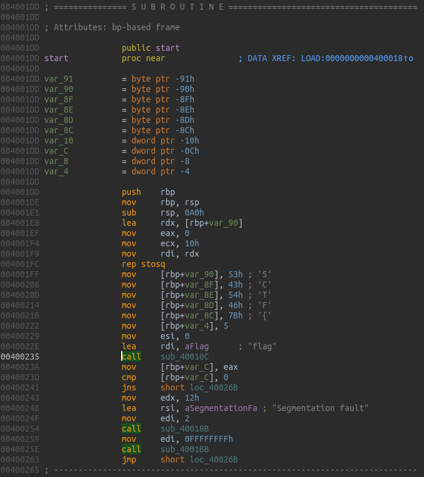

Remains Writeup
===

##### Target:
> cd27904d0d35497d1f7081b7af2919a6  data

### Solution:
1. Extract archive
2. Determine format of extracted file
    ```
    $ file X.sav 
    X.sav: data
    ```
    ```
    $ hd bin.sav | head -n 2
    00000000  7f 56 69 72 74 75 61 6c  42 6f 78 20 53 61 76 65  |.VirtualBox Save|
    00000010  64 53 74 61 74 65 20 56  32 2e 30 0a 00 00 00 00  |dState V2.0.....|
    ```
   
3. Googling for useful hints:
    * [Bitsctf 2017 Writeup](https://ox002147.gitlab.io/writeup-bitsctf-for60.html)
    * [ASIS Quals 2014 Writeup](http://blog.rentjong.net/2014/05/asis-quals-2014-forensic-300.html)
    
    However, mentioned tool `savparser` does not give useful info at first try.
    
    ```
    $ ./savparser bin.sav
    $ strings bin.sav-pgm.out | grep "SCTF{"
    SCTF{>p9v	*
    ```
   
   Neither, `binwalk` does, unless screen shoot: `binwalk -D "png image" bin.sav`
   
   
   So, we know that some program is on running state, and it is asking for some an input with.


4. SAV format
   There is a pretty good blog explaining [VirtualBox Live State File Format](https://parsiya.net/blog/2018-01-29-virtualbox-live-state-file-format/) and
   it is easier to understand source code of `savparser` tool.
   
   Also, there is [Kaitai Struct](https://kaitai.io/) to describe various binary data structures and create parsers in different languages, 
   and it has a Format Gallery with various formats, like [ELF](https://formats.kaitai.io/elf/), [UTF-8](https://formats.kaitai.io/utf8_string/), etc.
   So, we can proceed with `savparser` or quickly define own parser:
   
   ```yaml
   meta:
     id: sav
     file-extension: sav
     endian: le
     imports:
       - utf8_string
   
   seq:
     - id: header
       type: header
     - id: unit
       type: unit
       repeat: until
       repeat-until: _.magic == "\nTheEnd\0"
     ...
   
   types:
     header:
       seq:
         - id: magic
           contents: "\x7fVirtualBox SavedState V2.0\n\0\0\0\0"
         ...
   
     unit_data:
       seq:
         - id: record_type
           type: b4le
           enum: record_type
         ...
         - id: size
           type: utf8_string
         - id: data
           size: size.codepoints.value_as_int
   
     unit:
       seq:
         - id: magic
           size: 8
           type: str
           encoding: UTF-8
         ...
         - id: name_size
           type: u4
         - id: name
           size: name_size
           type: strz
           encoding: UTF-8
         - id: data
           type: unit_data
           repeat: until
           repeat-until: _.record_type == record_type::terminator or _.record_type == record_type::invalid
           if: magic == "\nUnit\n\0\0"
   
   enums:
     record_type:
       0: invalid
       1: terminator
       2: raw
       3: lzf
       4: zero_data
       5: named_data
   ```
   
   Note, that here we need to modify [utf8_string](https://formats.kaitai.io/utf8_string/) from Gallery, to read once, 
   instead of all file:
   ```yaml
   seq:
    - id: codepoints
      type: utf8_codepoint(_io.pos)
   ```
   
   Then compile it and [ELF](https://formats.kaitai.io/elf/) from format gallery for python language:
   ```
   ksc -t python sav.ksy
   ksc -t python elf.ksy
   ```
   As a result we get `sav.py`, `utf8_string.py` and `elf.py`.


5. Find ELF
   
   Start with finding `pgm` unit (PageManager) in `.sav` file with python:
   ```python
   from sav import Sav
   
   f = Sav.from_file("bin.sav")
   
   for u in f.unit:
      if u.name != "pgm":
         continue
   ```
   
   Iterate through data unit and LZF decompress data:
   
   ```python
    for d in u.data:
        if d.record_type == Sav.RecordType.lzf:
            length, data = d.data[0], d.data[1:]
            data = lzf.decompress(data, length*1024)
        else:
            data = d.data
   ```
   
   Since, we are looking for running ELF program, let's look for all occurrences of ELF magic in decompressed data and try to read its header:

   ```python
   for index in find(data, b"\x7fELF"):
      try:
          e = Elf.from_bytes(data[index:])
      except KaitaiStructError:
          pass
   ```
   
   Then iterate through its program headers, searching for header with programs code, so it has to be Executable and Readable non-Writable header.
   As we saw on the screenshot it has to contain "Wanna flag?" string as well.
   
   ```python
   for index in find(data, b"\x7fELF"):
      try:
          e = Elf.from_bytes(data[index:])
   
          if e.header.entry_point == 0:
              continue
   
          for ph in e.header.program_headers:
              if ph.flags_obj.value == 5 and ph.filesz > 0:
                  x = data[index + ph.offset: index + ph.offset + ph.filesz]
                  if b"Wanna flag?" in x:
                      print("[+]: Found ELF")
   
                      with open("elf", "wb") as o:
                          o.write(x)
   
      except KaitaiStructError:
          pass
   ```
   
   Turns out, we have only one such elf with entry point 0x4001dd. 
   If we try to run it, we wil get `Segmentation fault` error message.
   

6. Reverse Engineer binary
   
   Disassemble given elf binary in any disassembler, and reveal that binary use system calls for opening and closing files, stdin/stdout read-write operations.

   

   So, program opens file `flag` and reads its content into buffer on the stack with prefix "SCTF{" and suffix "}", asks "Wanna flag?", 
   waits for any key and starts decoding routine. 

   

   Due to prefix, now we can find out content of the file loaded into the buffer and decode it.

   ```python
   for index in find(data, b"SCTF{"):
      end = data.find(b"}", index)
      if end != -1:
          print("[+]: Found flag")
          with open("flag", "wb") as o:
              o.write(data[index + 5: end])
   ```
   
7. Profit!
   We have extracted the binary, and the flag content, so can reverse decoding routine (its XORing with 5-byte key "SCTF{") or just try to execute binary:
   ```
   $ chmod +x elf
   $ ./elf
   Wanna flag?
   SCTF{m3m0ry_15_7h3_k3y_n07_70_7h3_p457_bu7_70_7h3_ch4ll3n63!}
   ```
