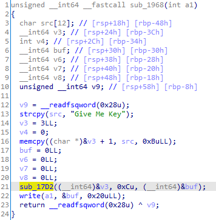

# Secure Enuough Writeup
Do reverse engineering with client binary and find weak points of its communication. Find symmetric key and decrypt packet data to find flag.

## Given
- pacpng file
- client binary

## Reversing
When we open analyze client binary then we can find four functions in main function.


### sub_1186


This function opens new connection with server.

### sub_1784


This function do simple client hello.
- Generate hashes
- Encrypt one of hashes with public key
- Exchange with server


This is image of client hello function. The function ```sub_107A``` generates md5 hash with rand() function as below.


It uses ```rand()``` and ```srand()``` to generate random bytes and generate two MD5 hashes with it.

Back to ```sub_13F1```, it encrypts one of hash with public key in function ```sub_1355``` and write two values to server.

And then server returns another encrypted MD5 hash values to client.


After generate and exchange three MD5 hash values, client and server generate secret_key and iv value from them as below.


### sub_1968


This function requests key from server. It encrypts the request message with key made from function ```sub_170F```.


We can find out that ```unk_2030A0``` is secret key and ```unk_2030C0``` is a iv for aes_256_cbc encryption.

### sub_1A28


This function receives response from server and decrypt the message. This message is what to be found out from this problem.

### Overall Communication Sequences
Below diagram is summarized this communication sequences.


## Flaws

The problem is in function ```sub_107A``` with random function. It initialize random seed with ```time()``` function which return current time in seconds. Since the function ```sub_107A``` is called two times consecutively, generated two md5 hash value will have same value by very high probability.

This flaw makes us to know encrypted md5 hash value.

## Finding flag from pcapng file

To decrypt encrypted message we need to know three values to generate secret key and iv value.
1. Plain MD5 hash from client hello
2. Public encrypted MD5 hash from client hello
3. Private encrypted MD5 hash from server hello

### Entire packet

Let's see the pcapang file


There are 2 tcp streams in it. The size of two streams is same but only the data is different.


### First packet

Let's start with first packet.


1. Head bytes of client hello
2. Plain MD5 hash
3. Encrypted MD5 hash value

We can find first MD5 hash values.
```
A3 E6 F4 84 D7 86 5A B1 05 6E 15 83 3C 74 8B ED B6 89 C0 61 3F A1 14 6A 35 F1 29 79 7A 77 05 14
```

And because of miuse of random generation function we can expect the encrypted MD5 value will be same with plain value. Therefore we found two MD5 values from here.

### Second packet

This packet is from the server, which is server hello it has last MD5 value we need to find. However it is encrypted with private key, we need to find public key and decrypt it. Public key can be found from client binary.


We can find encrypted MD5 hash value from second packet.


1. Head bytes of server hello
2. Encrypted MD5 hash value

### Decrypt with public key to get third MD5 hash

```c
#include <stdio.h>
#include <openssl/pem.h>

const char public_key[] = "-----BEGIN PUBLIC KEY-----\n\
MIIBIjANBgkqhkiG9w0BAQEFAAOCAQ8AMIIBCgKCAQEA214EFGCpMbQhB4uRo7P9\n\
FAajAfvz7ianshjD44IvZeZHeEYTfa1zONbjYGK2lw/0v+xZ/Em4M9sPOSGlsPcr\n\
vG3O9/XKM0+he05Lh8nedtMnpOQgxFhwJNbdKR3SYzsH8+JziLHAmKQmlmH8FBiE\n\
reGsshAhICrz8GGDCjDg7Aam4wKj0HY6hfj8zUYjAf2MxoozWIYFmjSXI2xwp6Kq\n\
Uqhac9W0nnQkToe+vtBjlcPowRV9WViNIB2msE6afe+YqKVSYNizbEXSbmocsA+A\n\
job4i1u8LAtdd4zF5gmGuKCJITiMMglakHzwosXXfbejIaJlpfC6sx4xIu6nkx6Y\n\
lQIDAQAB\n\
-----END PUBLIC KEY-----";

unsigned char msg[] = {0x0F, 0x4B, 0x82, 0xB9, 0xD7, 0x71, 0xA2, 0x62,
                       0x5D, 0xE1, 0x33, 0x92, 0x69, 0xEA, 0xD8, 0x59,
                       0x93, 0x08, 0xA5, 0x11, 0x9F, 0x3C, 0x8A, 0x3E,
                       0xB2, 0xE2, 0x66, 0xF0, 0x42, 0x10, 0xC2, 0xAC,
                       0x7E, 0x56, 0x57, 0x07, 0x2E, 0xCD, 0x5F, 0xB7,
                       0x77, 0xA9, 0x9A, 0x8D, 0x57, 0xD9, 0x4E, 0x39,
                       0xFA, 0x70, 0x01, 0xDD, 0x92, 0x6A, 0xC4, 0x2E,
                       0x4E, 0x9C, 0x94, 0x4C, 0xD0, 0x86, 0x86, 0x86,
                       0x05, 0xD5, 0x9D, 0xB7, 0x18, 0xCA, 0xF0, 0x73,
                       0x8F, 0x99, 0x83, 0x57, 0x51, 0x19, 0xE4, 0xAE,
                       0x63, 0xF8, 0x4C, 0x7A, 0x27, 0x4E, 0xBA, 0x7B,
                       0x39, 0xB9, 0xDC, 0x19, 0xA7, 0x49, 0xA9, 0xBC,
                       0xA7, 0xBE, 0xAD, 0x0A, 0xA7, 0x5E, 0xA8, 0xF2,
                       0xC3, 0x4A, 0x48, 0xDD, 0xA8, 0xA4, 0x81, 0x2E,
                       0x93, 0x32, 0x49, 0xE9, 0x45, 0xF6, 0x68, 0x58,
                       0x78, 0x59, 0x47, 0xD9, 0x51, 0x68, 0x15, 0x4B,
                       0x18, 0xE4, 0x4F, 0x0F, 0xFA, 0x4F, 0x3C, 0x0A,
                       0x33, 0x6E, 0xE2, 0xFC, 0x72, 0xF6, 0xB0, 0xAA,
                       0x1D, 0xEE, 0xBA, 0x5C, 0xD4, 0x64, 0x6E, 0x68,
                       0xAE, 0x59, 0x19, 0x23, 0xDC, 0x28, 0x94, 0x59,
                       0x78, 0x62, 0xA7, 0x53, 0xC3, 0xF8, 0x64, 0x09,
                       0xCC, 0x19, 0xB8, 0xB5, 0x07, 0x0D, 0xE0, 0x8F,
                       0xDA, 0xB3, 0x40, 0x61, 0x8E, 0x6F, 0xB9, 0x37,
                       0x0D, 0x95, 0xBF, 0x07, 0x67, 0x0D, 0x76, 0xCD,
                       0xF3, 0x20, 0xD5, 0xBD, 0x3B, 0xF1, 0x0C, 0x26,
                       0xEC, 0x89, 0xF4, 0x79, 0x56, 0xA4, 0xE6, 0xF8,
                       0x50, 0xF7, 0x51, 0xD7, 0x48, 0x0C, 0x82, 0xCB,
                       0x25, 0xF7, 0xA4, 0x8B, 0xA1, 0x67, 0xD2, 0x07,
                       0xD7, 0xA3, 0x83, 0x6C, 0x7D, 0xEE, 0x67, 0x9A,
                       0x7A, 0xC1, 0xE0, 0x04, 0xE0, 0x39, 0x95, 0x98,
                       0x99, 0x4E, 0x75, 0x42, 0xD6, 0x3E, 0x65, 0xEB,
                       0x24, 0xB4, 0x11, 0x58, 0xC6, 0x67, 0x28, 0x72};

void print_hash(unsigned char* buffer){
    char md5msg[70];
    for (int i=0; i<32; ++i){
        sprintf(md5msg+(i*2), "%02x", buffer[i]);
    }   
    printf("%s\n", md5msg);
}

int main() {
    unsigned char decrypt[256];
    RSA* rsa = NULL;
    BIO* keybio;
    keybio = BIO_new_mem_buf(public_key, -1);
    if (keybio == NULL) {
        perror("Failed to create key BIO");
        return 0;
    }

    rsa = PEM_read_bio_RSA_PUBKEY(keybio, &rsa, NULL, NULL);
    RSA_public_decrypt(256, msg, decrypt, rsa, RSA_PKCS1_PADDING);

    char md5msg[70] = { 0 };
    for (int i=0; i<32; ++i){
        sprintf(md5msg+(i*2), "%02x", decrypt[i]);
    }   
    printf("%s\n", md5msg);
    return 0;
}
```

```Shell
$ g++ -o decrypt decrypt.cpp -lcrypto
$ ./decrypt
0ae04f33e00939ba0e50c7ccc0a90d933374486d9afffd052be8c8462d666120
```

Finally we got all 3 md5 hashes.

1. A3E6F484D7865AB1056E15833C748BEDB689C0613FA1146A35F129797A770514
2. A3E6F484D7865AB1056E15833C748BEDB689C0613FA1146A35F129797A770514
3. 0AE04F33E00939BA0E50C7CCC0A90D933374486D9AFFFD052BE8C8462D666120

We need to do more to get AES-CBC key.


### Generate AES-CBC key and decrypt last packet

```python
import hashlib
from Crypto.Cipher import AES

md5_1 = "A3E6F484D7865AB1056E15833C748BEDB689C0613FA1146A35F129797A770514"
md5_2 = "A3E6F484D7865AB1056E15833C748BEDB689C0613FA1146A35F129797A770514"
md5_3 = "0AE04F33E00939BA0E50C7CCC0A90D933374486D9AFFFD052BE8C8462D666120"
md5_1b = bytes.fromhex(md5_1)
md5_2b = bytes.fromhex(md5_2)
md5_3b = bytes.fromhex(md5_3)
keys = md5_1b + md5_2b + md5_3b

def digest(add, keys):
    m = hashlib.md5()
    m.update(add.encode())
    m.update(keys[:32])
    m.update(keys[32:64])
    m.update(keys[64:])
    return m.hexdigest()


secret_key = digest("A", keys) + digest("BB", keys)
iv = digest("CCC", keys)

enc = bytes.fromhex("dc014f2266d9368dbd6fb5d3fa1d675cc2172ae703872afbadc94dc8cbc8afcda7c1177253fe51114041ad0103bbb86500000000000000000000000000000000")
key = bytes.fromhex(secret_key)
iv = bytes.fromhex(iv)

cipher = AES.new(key, AES.MODE_CBC, ivb)
plain = cipher.decrypt(enc[:64])

print(plain[1:].decode("utf-8", 'ignore'))
```

```Shell
$ python decrypt.py
SCTF{B3_CAR3_FULL_W1T4_RAND0M}6pE{w̫%[
```

Got flag from here.
