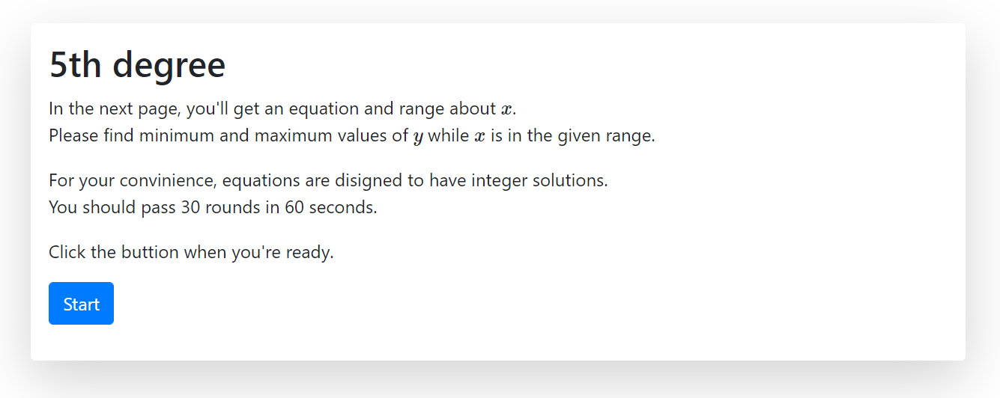
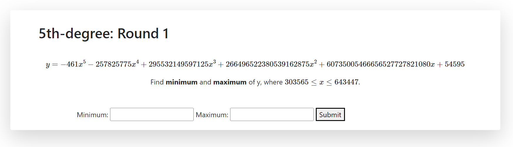

## 5th degree

### Description

> It's highschool math.
> 
> http://5thdegree.sstf.site

## Writeup

We should find the maximum and minimum of y where x is in the given range.

y is a quintic equation for x, and the maximum and minimum values of polynomials can be easily determined through differentiation.

We can obtain a quartic equation by differentiating y for x, and solving this equation - by using some math libraries or Ferrari's method or so on - yields the x coordinates of each vertex of y.

Then find y for the maximum and minimum values of x and the solutions between them, respectively, and the maximum and minimum values of them are the answers.

We should implement the whole process because we have to get many answers over and over again in a short time.

