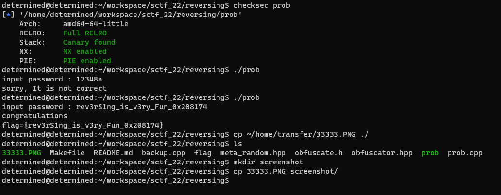

# introduction 
Problems implemented in c++ [playfair cipher](https://en.wikipedia.org/wiki/Playfair_cipher)  

The problem is that you need to reverse the binary to identify the logic and implement the decryt function  
finally User can decrypt cihper text in binary. 

- playfair algorithms uses the 5x5 key but binary uses the 8x8 key
- cipher text in binary is obfuscated. 

If you can understand its working, reversing is so straightforward.

Please refer to the challenge source code to understand and solve this challenge.

# build 
``` bash
make
```

# challenge


