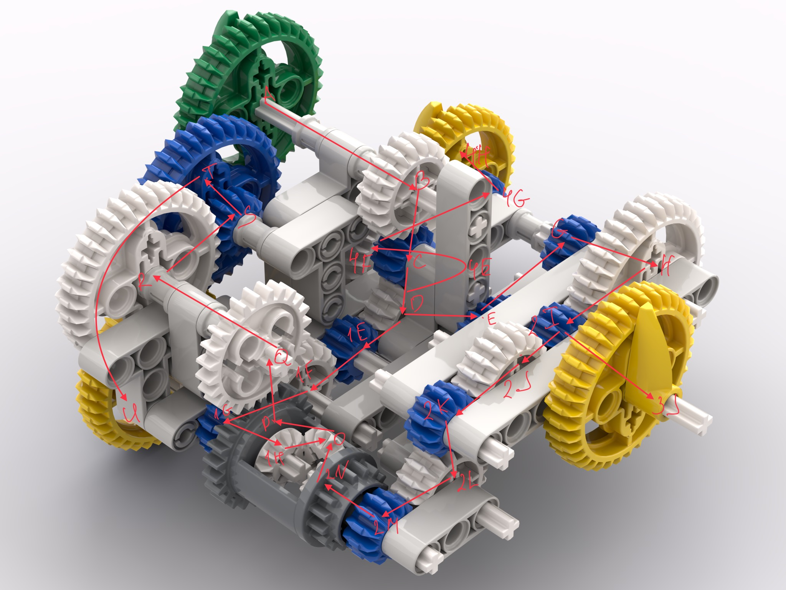
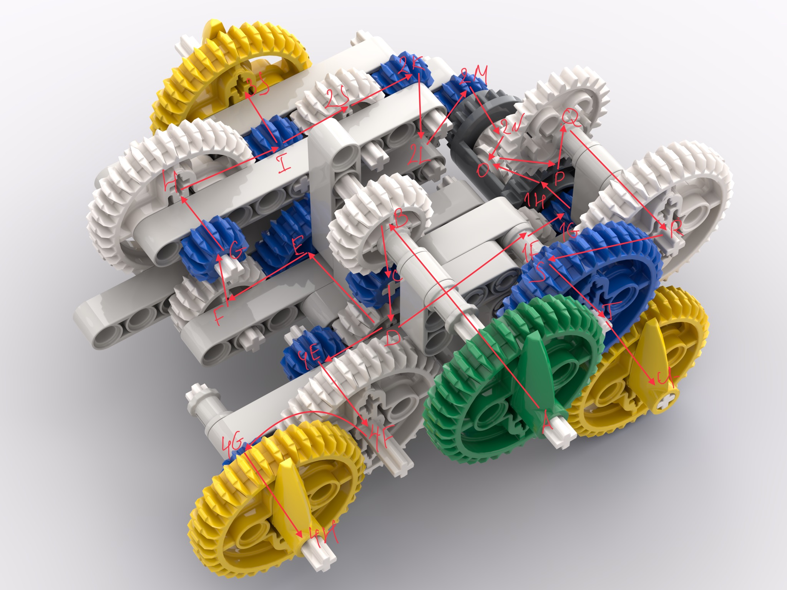

<h1>Legonigma</h1>
<h2>Task</h2>

<h2>Writeup</h2>

To decoding flag we must understand how the Legonigma machine work.
It means this crypto machine have input (the green one) and output (the yellow ones) gears which are marked with the pins.
Try to find how to look gears with different number of teeth in Lego.
Base on photos from Google input/output gears have 36 teeth.
It looks like English alphabet (`A`, `B`, .. `Z`) with numbers (`0`, .. `9`) correspond to each tooth of the input and output gears clockwise, starting from `A`.
How we can see on photo gears connected with one and based on number of teeth both of connected gears, angular velocity transferred with some relation.

Write as the formula where numbers of teeth division where they connected, and relation multiple when gears located on one axle:
1. `20/12 * 12/20 * 28/20 * 20/12 * 36/12 = 7`
2. `20/12 * 12/20 * 28/20 * 20/12 * 36/12 = 7`  
   `(7/1 + 5/3)/2 = 13/3 * 36/12 = 13`  
   `20/12 * 12/20 * 20/12 * 12/20 * 20/12 = 5/3 `
3. `20/12 * 12/20 * 20/12 * 36/12 = 5`

then we must solve congruence for every symbol with ciphertext:  
    `rotor_ratio * X == ord(symb) mod 36`  
and bruteforce alphabet order and output rotors order

After this from decode flag:
`59x8wl9pjsava3grn0il79aoq307f20a6huc3xnos289cd8xv1fn2znuoa2bq8959chbktwfow8c3azpvo3c59jz4`  
have:
`th3w0rld1sadang3rou5placeno7becau5e0fth0sewh0do3v1lbutbecau5eofth053wh0l00konandd0n0th1ng`  
with rotors setting:
13 &rarr; 5 &rarr; 7

