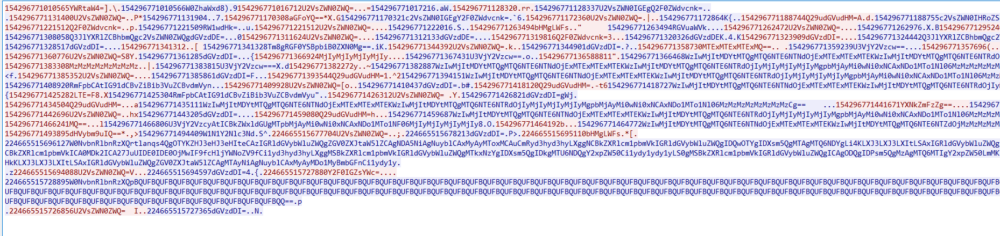
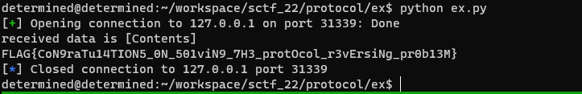

# introduction
The users need to analyze the given pcap file(communication between server and client) to find out the protocol.  
The users have to find out the hidden menu and admin bit through analysis and then obtain a flag.

## packet structure 
- header : 15 length of integer 
- contents : encoded base64 strings 
- crc : the crc32 of [header + contents] 

### header 
 The header consists of a total of 48bits and it is 6byte integer value.(length 15)
``` python
   Delimiter=(47,1) # 
   Admin=(46,1) # admin bit for hidden menu
   Date=(13,8589934591) # Error occurs when packet time differs from server time by more than 60 seconds
   Cmd=(10,7) #3 # Total Counts of command is 8
   Ans=(9,1) # 1 server response : True False bit 
   ContentLength=(0,511) #9 The length of base64 encoded contents 
```

### commands
```python
class Cmd(Enum):
    Admin=0 # command for activating admin bit
    Select=1  # select database
    Create=2  # create database 
    Show=3  # print contents of database
    Write=4  # write contents to database
    Delete=5 # delete specific contents of database
    Get=6 # listup database or contens of database
    Hidden=7 # hidden shell command menu
```

# solution
The given pcap file contains the 7 commands except for the hidden command  
The user should analyze the pcap and figure out the protocol and header structure of protocol  
and The user should appropriately use the server's response to understand the configuration of the protocol.   
if user figure out the header of protocol, user will see that one command is emtpy.  
and then user can try send the packet to server with hidden command and receive the server's response which is "Denied"  
User must find 1bit to bypass "Denied" problem and execute hidden menu through it.  
finally user can get the flag.



# ex
```
cd ex; python ex.py
```


# build & run
```bash
./build.sh; ./run.sh
```

# directory 
```bash
.
├── README.md
├── build.sh  # proxy & prob docker build
├── run.sh # run proxy docker 
├── ex # exploit folder
│   ├── ex.py # exploit file 
│   └── protocol.py # test file 
├── prob
│   ├── Dockerfile 
│   ├── build.sh 
│   └── deploy
│       ├── flag
│       └── sprotocol.py
└── proxy 
    ├── Dockerfile
    └── build.sh

```

