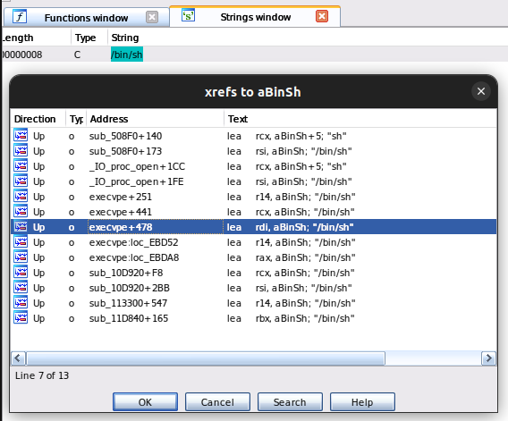
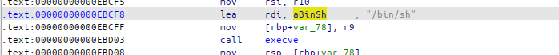
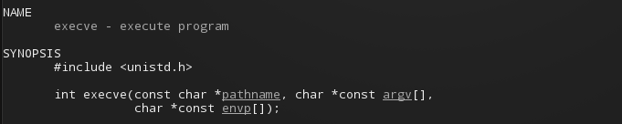
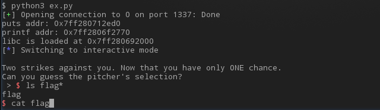
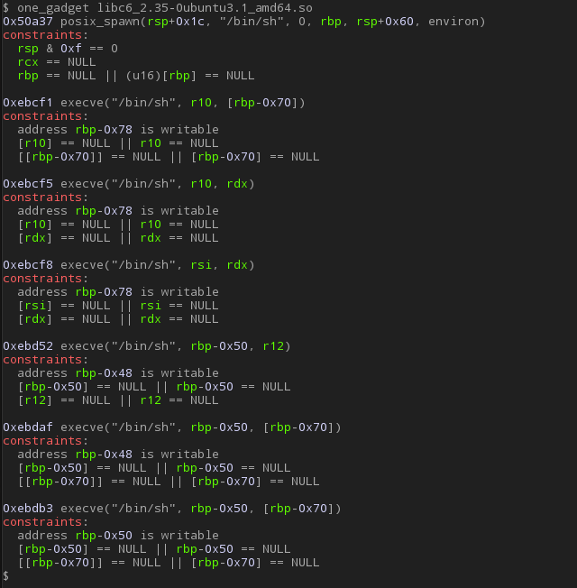

## 2 Outs in the Ninth Inning

### Description

>You're at the bottom of the 9th with 2 outs.
>
>Can you hit a home run at the last chance?
>
>Download: **9end2outs.zip**
>
>Server: `nc 9end2outs.sstf.site 1337`

### Writeup

```c
int __cdecl __noreturn main(int argc, const char **argv, const char **envp)
{
  char v3; // bl
  char *v4; // r12
  void *handle; // [rsp+0h] [rbp-40h]
  char v6[8]; // [rsp+8h] [rbp-38h] BYREF
  int (**v7)(const char *, ...); // [rsp+10h] [rbp-30h]
  unsigned int v8; // [rsp+18h] [rbp-28h]
  unsigned int v9; // [rsp+1Ch] [rbp-24h]
  unsigned __int64 v10; // [rsp+28h] [rbp-18h]

  v10 = __readfsqword(0x28u);
  setbuf(stdin, 0LL);
  setbuf(stdout, 0LL);
  alarm(0xAu);
  v7 = &printf;
  v8 = 0;
  v9 = 0;
  handle = dlopen("libc.so.6", 2);
  puts("You have only 3 chances to win the game.");
  puts("\nThe 1st chacne: Get libc symbol info.");
  showFuncAddr(handle);
  puts("\nThe 2nd chacne: Get libc symbol info.");
  showFuncAddr(handle);
  puts("\nTwo strikes against you. Now that you have only ONE chance.");
  printf("Can you guess the pitcher's selection?\n > ");
  fgets(v6, 16, stdin);
  v3 = v6[0];
  v4 = pitches;
  if ( v3 == v4[rand() % 26] )
    ((void (__fastcall *)(const char *))v7)(" You hit the ball! It's an amazing walk-off homerun. Your team won the game.\n");
  else
    ((void (*)(const char *, ...))v7)(" Struck out. Game Over - You got %d hits and %d runs.\n", v8, v9);
  dlclose(handle);
  exit(0);
}
```

This program loads libc library and gives addresses of two functions. We can find out the version of libc from these addresses, and use it to download the libc file from the public repository - it's a typical procedure in the Return-To-Libc attack process.

And there's a BOF vulnerability that overwrites a function pointer, `v7`, pointing to the `printf` function.

As a result, we can jump to anywhere in the libc. However, it is possible only once because we don't know the address of the executable file.


Therefore, we need to find a routine in libc that allows us to get a shell with just ONE try.

As is well known, libc contains functions such as `system` and `execve` that can execute arbitrary commands in the shell, and the string "/bin/sh" is indispensable for the implementation of these functions.




Let's find the string "/bin/sh" in the libc and points that refer to it.



Among the cross references, we can find a point `execve+478 == 0xEBCF8` that stores the address of "/bin/sh" into rdi and calls `execve`.



The `execve` function here will launch a `/bin/sh ` process if both `argv` and `envp` are null pointers. According to the challenge binary, `v7` function will be called with zero `rsi` and `rdx` registers within the `else` case.

Therefore, we may get the shell if we jump to the offset `0xebcf8`.


The exploit is not that complex. Connect to the server, get the address of some functions, calculate the address where libc loaded and the jump-target address, and finally jump to there.





We call such code blocks like those at 0xebcf8 offset one gadget or one-shot gadget.

Actually, there're some tools such as [one_gadget](https://github.com/david942j/one_gadget) to find one gadgets from the binary.

For example, **one_gadget** will give you 7 one gadgets from this libc library.


