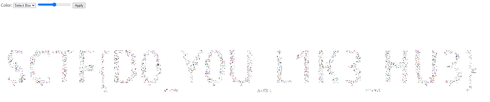

## Exploit

### Summary
Try to change color of each box by select box in UI.
It is easy to figure out that each css is part of either backgroun or character.

1. Get border box class names
2. Remove those class name from css
3. Reopen the html file

### Example

- Get border boxes from chrome develeoper tool
    ```js
    function getOutBox(row) {
        let childs1 = document.getElementsByClassName('row')[row].childNodes;
        let outBoxes = new Set();
        for (i=0; i<childs1.length; i++) {
            let className = childs1[i].className;
            if (className !== undefined)
                outBoxes.add(className.split(' ')[1]);
        }
        return outBoxes;
    }
    ```
    ```
    block18|block389|block68|block348|block32|block...
    ```

- Remove those css with sed
    ```bash
    sed -E '/(block18|block389|block68|block348|block32|...).*}/d' index.html  > removed.index.html
    ```

- Reopen the html file
    