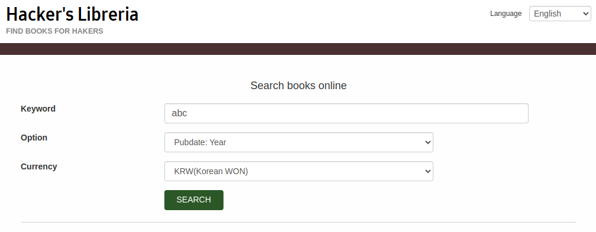
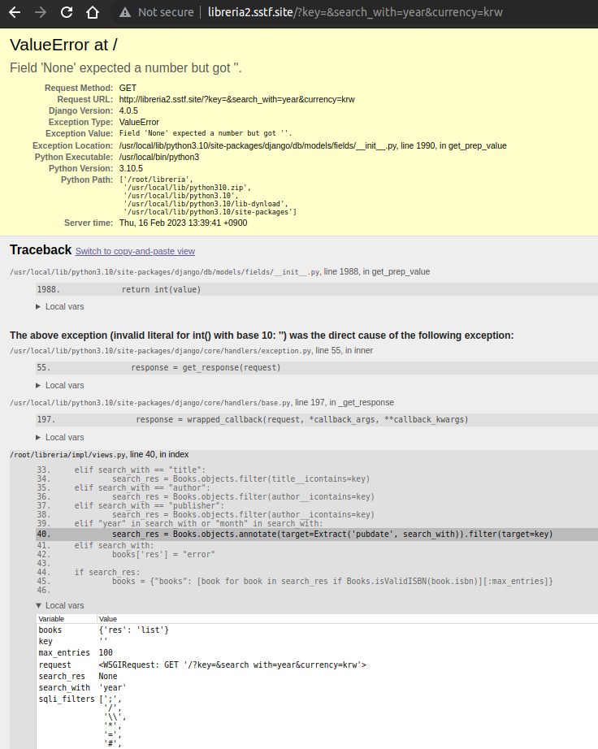
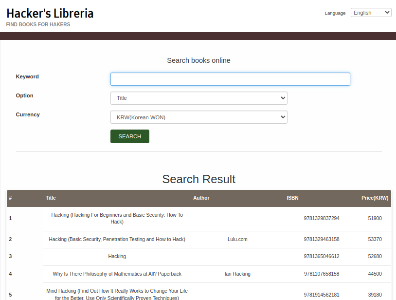
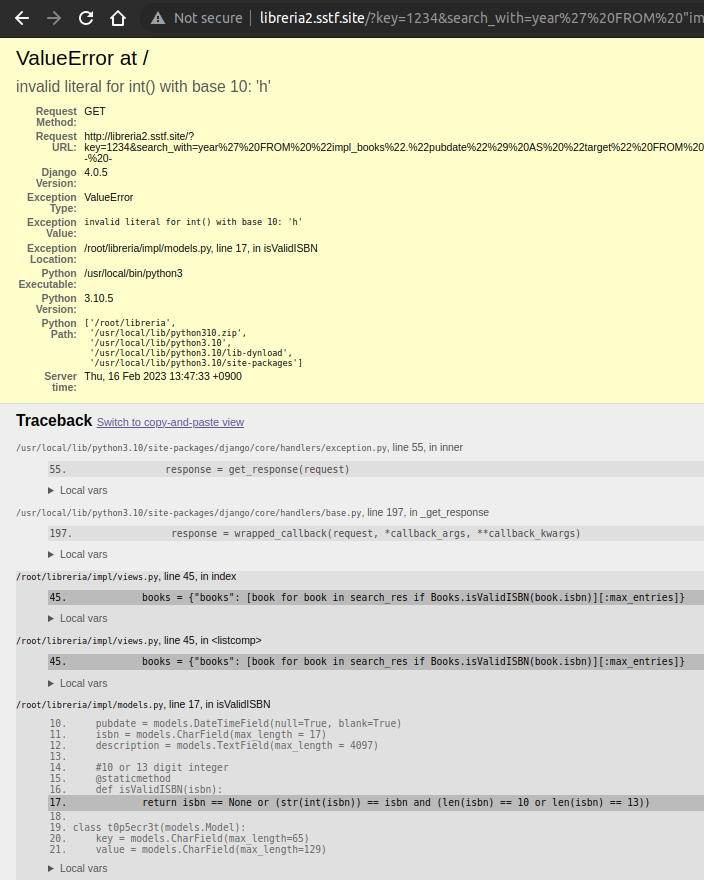

# Libreria Pro

**Libreria1**와 유사한 서비스가 있는데, 도서 구매요청 기능은 없어지고, 검색 옵션이 추가되었다.




기능 자체는 복잡하지 않은데, `Pubdate:Year`를 선택한 후 검색어를 정수 형태가 아닌 값이나  값을 지정하지 않으면 오류 페이지가 나온다. (검색 메뉴에서 `Pubdate:Year` 또는 `Pubdate:Month`를 선택하고 정수가 아닌 값을 넣으면 서버로 값이 전송되지 않으므로 URL을 수정해야 한다.)



디버그 모드로 실행되고 있어서 오류메세지가 자세하게 출력되는데, 살펴보면 django 프레임워크와 postgresql을 이용해서 구현된 서비스임을 알 수 있고, 일부 코드와 지역 변수들의 값도 볼 수 있다.

코드를 보면 SQL 쿼리를 직접 작성하는 것이 아니라 django의 모델을 이용해서 데이터베이스에 접근하고 있어서 별달리 공격할만한 포인트가 보이지 않는지만, 지역 변수에 `sqli_filters`가 존재하는 것을 보면 필터를 우회했을 때 SQL Injection 공격이 가능한 포인트가 있을 것 같기도 하다.

`django 4.0.5 sql injection`으로 구글링을 해보면 `CVE-2022-34265`에 대한 설명과 PoC가 있는 [페이지](https://github.com/aeyesec/CVE-2022-34265)를 찾을 수 있다. 이 취약점을 이용하면 django에서 `Trunc` 또는 `Extract` 함수를 사용할 때 SQLi가 가능한데, 코드를 보면 `year ` 또는 `month`를 이용해서 검색할 때 `Extract` 함수가 사용되고 있어서 여기가 SQLi 포인트임을 알 수 있다 

SQLi 공격을 시도하려면 DB로 전송되는 쿼리의 구성을 알아야 한다. 위의 디버그 페이지에 있는 코드의 경로 `/root/libreria/impl/views.py`로부터 django app의 이름이 `impl`임을 유추할 수 있고, 모델 클래스의 이름이 `Books` 이므로 테이블의 이름이 `impl_books`일 것을 짐작할 수 있다. 

참고) [CVE-2022-34265 PoC](https://github.com/aeyesec/CVE-2022-34265) 코드가 django와 postgresql로 구성되어 있으므로 DB의 로그 레벨을 수정해서 쿼리를 출력해보면 DB와 쿼리 구성을 쉽게 이해할 수 있다.

`Extract` 함수의 취약점을 이용해서 아래와 같은 샘플 SQLi 쿼리를 작성해 보았다. (쿼리를 이해하기 편하도록 추가한 첫번째 따옴표는 제외하고, 나머지 값을 URL 인코딩 해서 `search_with`의 값으로 보내면 된다.)

```sql
 'year' FROM "impl_books"."pubdate") AS "target" FROM "impl_books" -- -
```



1234라는 키워드로 연도를 검색했는데 오류가 발생하지 않고 SQLi가 동작해서 책 목록이 정상적으로 출력되었다. WHERE 절을 주석처리 했기 때문에 모든 도서(최대 100권)가 검색되었다. 

이제 UNION SELECT를 이용해서 DB를 파악해 보자.

```sql
'year' FROM "impl_books"."pubdate") AS "target" FROM "impl_books" UNION SELECT NULL, NULL, NULL, NULL, NULL, NULL, NULL, NULL, NULL, NULL  -- -
```

총 10개의 NULL을 넣어야 오류가 발생하지 않는데, `EXTRACT`로 인해 추가된 `target`을 제외하면 `impl_books`에는 9개의 컬럼이 있는 것을 알 수 있다. UNION SELECT를 이용해서 데이터를 뽑아보려고 하면 기존 쿼리로 인한 검색 결과가 100개를 넘어서 데이터를 확인할 수 없는데 `LIMIT`이나 `OFFSET`도 필터링 되므로 `WHERE`절을 추가해서 `UNION SELECT`의 결과만 확인할 수 있게 해보자. 

`WHERE AND 1=0`을 추가하면 가장 간단할 것 같은데, `sqli_filters`에 `=`를 비롯한 boolean 연산자가 모두 포함되어 있어서 우회할 방법을 찾아야 할 것 같다. 

postgresql은 2012년에 발표된 9.2버전부터 JSON을 지원하고 있으므로 JSON 연산자를 이용해 보자. (적당한 다른 방법으로 필터를 우회해도 된다.) Boolean을 리턴하는 JSON 연산자 중에 필터에 걸리지 않을만한 것을 찾아보면 `?`를 찾을 수 있다. 항상 False가 되는 식을 간단히 작성하면 된다.

이제 DB에 어떤 테이블과 컬럼들이 있는지 알아봐야 하는데, `OR`과 `IN`이라는 문자열이 필터링 되고 있어서 `INFORMATION_SCHEMA`를 이용할 수가 없다.

views.py의 코드를 좀 더 살펴보면 검색 결과 중에서 ISBN이 유효한 책들만 한번 더 필터링 하는 것을 알 수 있다. 이 때 `Books.isValidISBN`이라는 Books의 static method를 사용하는데, `isValidISBN` 함수는 아마도 Books 모델 정보와 함께 있을 것이므로 `isValidISBN` 함수 내부에서 예외를 일으키면 Debug 모드로 인해 코드 일부를 확인할 수 있을 것 같다.

DB에는 당연히 유효한 ISBN들만 있을 테니 잘못된 ISBN을 넣어 보자.

```sql
'year' FROM "impl_books"."pubdate") AS "target" FROM "impl_books" WHERE '{"a":1}'::jsonb ? 'b' UNION SELECT 1, 'b', 'c', 'd', 5, 'f', NULL, 'h', 'i', 10 FROM impl_books -- -
```

각 컬럼의 타입을 고려해서 유효한 ISBN일 리가 없는 값들을 넣어주다 보면 예외가 발생하고 isValidISBN 함수의 구현을 볼 수 있다.



`isValidISBN` 함수 구현은 `Books` 클래스 내에 있는 것일 텐데, 아래쪽으로 `t0p5ecr3t`라는 이름의 클래스가 정의되어 있는 것을 볼 수 있다. 이름만 봐도 매우 비밀스러운 데이터가 저장되어 있을 것 같다. `t0p5ecr3t` 테이블에는 `key`와 `value` 컬럼이 있는데, 여기에 어떤 값이 있을지 확인해 보자.

```sql
'year' FROM "impl_books"."pubdate") AS "target" FROM "impl_books" WHERE '{"a":1}'::jsonb ? 'b' UNION SELECT NULL, key, NULL, value, NULL, NULL, NULL, NULL, NULL, NULL  FROM impl_t0p5ecr3t -- -
```

위의 쿼리를 전송하면 `t0ps5ecr3t` 테이블의 레코드들 중에 있는 플래그를 획득할 수 있다.

