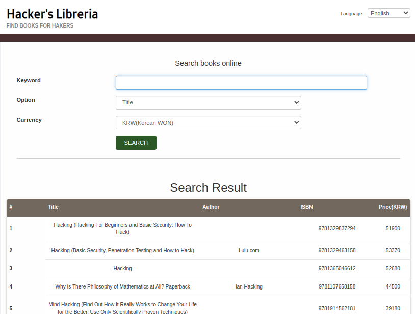

# Libreria Pro

There is a service similar to **Libreria**, but the book purchase request UI has been removed and search options have been added.


The function itself is not complicated, but if we select `Pubdate:Year` and do not specify a value or value other than an integer form, an error page appears.


It can be seen that the service was implemented using the django framework and postgresql, and since it is running in **debug** mode, we can also find some code and local variables.

We can't find any points on the source code to attack because it's accessing the database using django's model, not directly writing the SQL query. However, the presence of `sqli_filters` in local variables tells there're some points for SQL injection attacks.

By googling with `django 4.0.5 sql injection`, we can find a [page](https://github.com/aeyesec/CVE-2022-34265) with the description of CVE-2022-34265 and PoC. Using this vulnerability, SQLi is possible when using the `Trunc` or `Extract` function in django, and the code shows that the `Extract` function is used when searching using `year` or `month`, indicating that this is the SQLi point.

To attempt an SQLi attack, we need to know the configuration of the query transmitted to the DB. From the path of the code on the debug page above, it can be inferred that the name of the django app is `impl`, and since the name of the model class is `Books`, it can be assumed that the name of the table is `impl_books`.

Note) [CVE-2022-34265 PoC](https://github.com/aeyesec/CVE-2022-34265) code consists of django and postgresql, so you can easily understand the query configuration by modifying the log level of the DB.

Using the vulnerability of the `Extract` function, the following sample SQLi query was created. (Excluding the first quotation mark - it is added to make the query easier to understand, and we can send the URL-encoded query to the value of `search_with`.)

```sql
 'year' FROM "impl_books"."pubdate") AS "target" FROM "impl_books" -- -
```



I searched for the year with the keyword 1234, but there was no error and SQLi operated, so the book list was output normally. All books (up to 100 books) were searched because the WHERE section was annotated.

Now, let's use UNION SELECT to figure out the DB.

```sql
'year' FROM "impl_books"."pubdate") AS "target" FROM "impl_books" UNION SELECT NULL, NULL, NULL, NULL, NULL, NULL, NULL, NULL, NULL, NULL  -- -
```

10 NULLs must be inserted to prevent errors. Except for the `target` added by `EXTRACT`, it can be seen that there are 9 columns in `Impl_books`. When we try to extract data using UNION SELECT, we can't see the data because there are more than 100 search results due to existing queries, but `LIMIT` and `OFFSET` are also filtered, we should try to add `WHERE` clause to check only the results from UNION SELECT.

I think adding `WHERE AND 1=0` would be the simplest, but since all boolean operators including `=` are included in `sqli_filters`, we need to find a way to bypass.

postgresql supports JSON from version 9.2 released in 2012, so let's use the JSON operator. (Of course, you can use other way if it can detour the filtering.) We can find a boolean operator, `?`, that may not be caught by the filter among JSON operators. We can write a simple equation that always becomes False.

Now, we need to find out what tables and columns are in the DB, but as the strings `OR` and `IN` are filtered, `INFORMATION_SCHEMA` is not available.

From looking more at the code of **views.py**, we can see that the searched books are filtered again to filter out some books with invalid ISBN. At this time, the static method of Books called `Books.isValidISBN` is used. The implementation of `isValidISBN` function is probably with the Books model information, so if an exception is made inside the `isValidISBN` function, some of the code can be leaked due to the debug mode.

Certainly, there'll be only valid ISBNs in the DB, so let's put the wrong ISBN.

```sql
'year' FROM "impl_books"."pubdate") AS "target" FROM "impl_books" WHERE '{"a":1}'::jsonb ? 'b' UNION SELECT 1, 'b', 'c', 'd', 5, 'f', NULL, 'h', 'i', 10 FROM impl_books -- -
```

Putting invalid ISBNs considering the type of each column, exceptions occur and we can see the implementation of the `isValidISBN` function.


The implementation of the `isValidISBN` function is probably within the `Books` class, and we can see that a class named `t0p5ecr3t` is defined below. Just by looking at the name, it seems that very secret data is stored. There are `key` and `value` columns in the `t0p5ecr3t` table, so let's check what records there are.

```sql
'year' FROM "impl_books"."pubdate") AS "target" FROM "impl_books" WHERE '{"a":1}'::jsonb ? 'b' UNION SELECT NULL, key, NULL, value, NULL, NULL, NULL, NULL, NULL, NULL  FROM impl_t0p5ecr3t -- -
```

The flag in the records of the ‘t0ps5ecr3t’ table can be obtained by using the query above.

