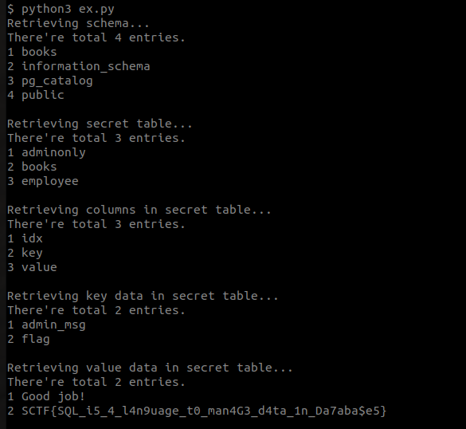

# Libreria

서버 코드가 같이 주어지는데, config.php 파일에는 별달리 도움될만한 정보가 없고, index.php에서도 prepared_statement를 이용해서 검색 쿼리를 처리하도록 구현되어있다.


res.php는 `findbyisbn`과 `requestbook` 두 가지 명령을 처리하는데, 이 중 `requestbook` 처리 과정에 SQLi 취약점이 존재한다.

```php
<?php
include "./config.php";

function err_handler($errno, $msg, $file, $line)
{
	return true;
}
set_error_handler("err_handler");

$resp_time = 3.0;

$start = microtime(true);

if (!isset($_GET['cmd'])) die;

$res = '{"res": "request failed."}';

$cmd = $_GET['cmd'];
switch($cmd) {
	case 'findbyisbn':
		if ((isset($_GET['isbn']) && strlen($_GET['isbn']) >= 10)) {
			$db = dbconnect();
			pg_prepare($db, "find_by_isbn", "SELECT * FROM books WHERE isbn=$1");
			$result = pg_execute($db, "find_by_isbn", array($_GET['isbn']));
			pg_close($db);
			if($result) {
		        $rows = pg_fetch_assoc($result);
				if ($rows) $res = json_encode($rows);
			}
		}
		break;
	case 'requestbook':
		if ((isset($_GET['isbn']) && strlen($_GET['isbn']) >= 10)) {
			$res = '{"res": "Sorry, but our budget is not enough to buy <a href=\'https://isbnsearch.org/isbn/'.$_GET['isbn'].'\'>this book</a>."}';
			$db = dbconnect();
			$result = pg_query($db, "SELECT ISBN FROM books WHERE isbn='".$_GET['isbn']."'");
			pg_close($db);
			if ($result) {
				$rows = pg_fetch_assoc($result);
				if ($rows) {
					$isbn = (int)$rows["isbn"];
					echo $rows["isbn"].'|'.$isbn;
					if (($isbn >= 1000000000) && ((string)$isbn === $rows["isbn"]))
					{
						$res = '{"res": "We already have this book('.$rows["isbn"].')."}';
					}
				}
			}
		}
		break;
	default:
		die;
}

$now = microtime(true);

if ($now - $start < $resp_time) {
	usleep((int)(($resp_time + $start - $now) * 1000000));
}

echo $res;

?>
```

이 API는 요청한 ISBN이 DB에 있는지 확인하고, 존재한다면 ISBN을 그대로 리턴하는데, 리턴 값이 10자리 이상의 정수 형태여야만 클라이언트 측에서 값을 확인할 수 있다.

SQLi의 결과를 10자리 이상의 정수 형태가 되도록 쿼리를 구성하거나 Blind SQLi를 시도하면 될 것 같은데, 응답 시간이 최소 3초 이상이 되도록 구현되어 있어서 Blind SQLi는 비효율적일 것 같다.

SQLi의 동작을 확인하기 위해서 `SELECT COUNT(*) FROM INFORMATION_SCHEMA.SCHEMATA`의 결과를 확인해보자.

데이터베이스에 있는 스키마가 1000000000를 넘을 것 같진 않으니 `SELECT 1000000000+COUNT(*) FROM INFORMATION_SCHEMA.SCHEMATA`를 날려보면 되는데, `+` 기호는 URL에 실려 전송될 때 공백으로 인식될 수 있으니 urlencode를 적용해서 `%2b`로 바꿔주면 된다.


`/rest.php?cmd=requestbook&isbn=1' union select1000000000%2bcount(*) from information_schema.schemata -- -`와 같이 쿼리를 작성해서 날려주면 json 형태의 응답값을 확인할 수 있고, 총 4개의 스키마가 있음을 알 수 있다.

`ascii` 함수와 `substr` 함수를 이용하면 문자열을 한 글자씩 숫자로 변환해서 읽는 것이 가능한데, 한 번의 쿼리에 3초가 소요되기 때문에 shift 연산을 이용해서 네 글자씩 읽어오면 시간을 많이 절약할 수 있다.


튜토리얼에서와 마찬가지로, information_schema로부터 스키마, 테이블이름, 컬럼 정보를 순서대로 확보한 후 테이블의 정보를 읽으면 flag를 획득할 수 있다.




