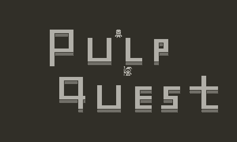
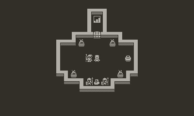
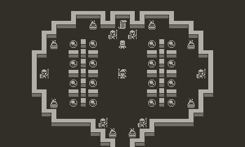
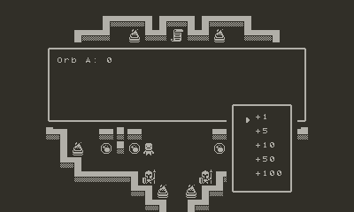
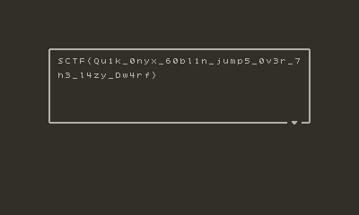

# PulpQuest



## Intro
Given a zip file `PulpQuest.pdx.zip` we can see it is a zipped game files for a [Playdate](https://play.date/) 
gaming console ([SDK and emulator](https://play.date/dev/) are available).
There are some useful [tools and info](https://github.com/jaames/playdate-reverse-engineering) about game files.

### Lua 5.4 vs Json
Gathering all info and playing around, we can spot the `data.pdz` is a compressed Lua bytecode on game's data. 
We may unpack and decompile, however, there is a `data.json.zip` that is produced by official web tool
[Playdate Pulp](https://play.date/dev/#cardPulp) and contains same data in Json format, which is easier to analyze.
Turns out, that we can delete `data.pdz`, extract `data.json` and load the game:



```
17:20:08: Loading: D:\PulpQuest.pdx\
17:20:08: Loading: OK
loaded json in 15ms
caching bitmaps...
	using frames.pdt
	using pipe.pdt
	using chars.pdt
ready in 29ms
```

### The Magic Orbs
Relaxing a couple of minutes and play the game, defeat the evil and enter `The Hall of Galf`.



There are 16 `The Magic Orbs` assigned names `A`..`P` and `The Magic Scroll` that says 
`Only The Reverse Skill Proven can read The Magic Scroll. Restore The Magic Orbs`.
Each orb may be filled with value in a range of `0..255`.



Looks like we have a 16-byte input string and correct value should reveal the flag.

### Prove reverse skill

Let's start to analyse compiled [PulpScript](https://play.date/pulp/docs/pulpscript/#goto-pulpscript) in `data.json`, 
by looking for a string `Only The Reverse Skill Proven can read The Magic Scroll`:

```json
{
  "id": 38,
  "data": {
    "__blocks": [
      [
        ["_", 1],
        ["tell", ["get", "event.room"], ["block", 1]]
      ],
      [
        ["_", 2],
        ["set", "a", ["get", "A"]],
        ...
        ["set", "p", ["get", "P"]],
        -1,
        ["call", "foo"],
        ["call", "bar"],
        -1,
        ["set", "A", ["get", "a"]],
        ...
        ["set", "P", ["get", "p"]],
        -1,
        [
          "log",
          [
            "format",
            ["get", "A"],
            "-",
            ...
            "-",
            ["get", "P"]
          ]
        ],
        -1,
        [
          "if",
          ["eq", "a8", 0],
          ["block", 2],
          ["else", ["block", 3]]
        ]
      ],
      [
        ["_", 42],
        ["call", "baz"],
        ["log", ["format", ["get", "s"]]],
        ["fin", ["format", ["get", "s"]]]
      ],
      [
        ["_", 46],
        ["log", "Nope"],
        ["say", "The Magic Scroll: Only The Reverse Skill Proven can read The Magic Scroll.\nRestore The Magic Orbs"]
      ]
    ],
    "interact": ["block", 0],
    "__comments": [],
    "__srcOrder": ["interact"]
  },
  "type": 2
}
```

Reconstructing a json blocks by numbers, we can decompile PulpScript as following:
```shell
on interact do
  tell event.room to
    a = A
    ...
    p = P

    call "foo"
    call "bar"

    A = a
    ...
    P = p

    log "{A}-{B}-{C}-{D}-{E}-{F}-{G}-{H}-{I}-{J}-{K}-{L}-{M}-{N}-{O}-{P}"

    if a8==0 then
      call "baz"
      log "{s}"
      fin "{s}"
    else
      log "Nope"
      say "The Magic Scroll: Only The Reverse Skill Proven can read The Magic Scroll.\nRestore The Magic Orbs"
    end
  end
end
```

Thus, we can see a chain of calls to `foo`, `bar`, then checking `a8` variable and finishing the game after calling `baz`.

#### Reverse baz

PulpScrip does not have definition of functions but have event handlers instead. 
Global variables may be used as function arguments and used for returning results.

Event `baz` is a series of calls to `fred` event, each is setting `x2` variable to `A`..`P` variables and `y2` as a series of constants.
After the call, `x2` variable, probably, have the result of computations, concatenated to string `s`.

```shell
on baz do
  s = ""
  
  x2 = A
  y2 = 42
  call "fred"
  s = "{s}{chr:x2}"
  
  ...
  
  x2 = P
  y2 = 196
  call "fred"
  s = "{s}{chr:x2}"
end
```

##### Reverse fred & qux
Event `fred` uses variables `x2`, `y2` as function arguments, and return result at `x2`:
```shell
on fred do
  a2 = x2
  b2 = y2
  c2 = 0
  d2 = 1
  
  i2 = 0
  while i2<8 do
    i2 += 1
  
    x1 = a2
    y1 = 2
    call "qux"
    a2 = x1
    e2 = y1
  
    x1 = b2
    y1 = 2
    call "qux"
    b2 = x1
    f2 = y1
  
    e2 += f2
    if e2==1 then
      c2 += d2
    end
  
    d2 *= 2
  end
  
  x2 = c2
end
```

Let's look at event `qux`, where variables `x1`, `y1` are arguments:
```shell
on qux do
  a1 = x1
  b1 = x1
  b1 /= y1
  b1 = floor b1
  x1 = b1
  
  b1 *= y1
  a1 -= b1
  
  y1 = a1
end
```

Thus, we can see that this is a modulo division function implemented via rounding down function `floor`, 
where `x1` returns quotient and `y1` returns remainder.

Now, it is clear that `fred` is a `xor` operation doing it bit-by-bit using arithmetic operations only.
It makes sense, since PulpScript does not have built-in bitwise operations like `mod` and `xor`.

Same, event `baz` is a xoring input string `A`..`P` with constant array, to form string in variable `s` and display it, which is probably the flag.

#### Reverse bar
Event `bar` is mush the same as `baz`, but this time xoring input with constants is accumulated in variable `a8` that is than compared to zero.  

```shell
on bar do
  x2 = A
  y2 = 36
  call "fred"
  a8 = x2
  
  ...
  
  x2 = P
  y2 = 137
  call "fred"
  a8 += x2
end
```
So, this is a verification function, since `a xor a = 0`.

#### Reverse foo
Now we have a series of calls to `boo`, where `a0`, `b0`, `c0`, `d0` are 4-byte input (`A, B, C, D` then `E, F, G, H` etc.), `e0` and `f0` are constants, and 4-byte output:
```shell
on foo do
  a0 = A
  b0 = B
  c0 = C
  d0 = D
  e0 = 36
  f0 = 23
  call "boo"
  B = a0
  C = b0
  D = c0
  A = d0
  ...
end
```
There are 8 rounds of round-function `boo` mixing 4-byte inputs.

##### Reverse boo
Here we have more calls to `fred` (aka `xor`), `corge` and `abc`
```shell
on boo do
  x2 = a0
  y2 = b0
  call "fred"
  a8 = x2
  
  x6 = a8
  y6 = b0
  call "corge"
  b8 = x6
  
  ...
  
  x7 = b8
  y7 = f0
  call "abc"
  d0 = x7
end
```

Event `abc` is an additional operation modulo 256:
```shell
on abc do
  a7 = x7
  a7 += y7
  
  x1 = a7
  y1 = 256
  call "qux"
  x7 = y1
end
```

###### Reverse corge
Here we have more calls to `thud`, `plugh` and `ork`:
```shell
on corge do
  x1 = y6
  y1 = 8
  call "qux"
  
  x4 = x6
  y4 = y1
  call "thud"
  
  d6 = 8
  d6 -= y1
  
  x5 = x6
  y5 = d6
  call "plugh"
  
  x3 = x4
  y3 = x5
  call "ork"
  x6 = x3
end
```

Where `thud` and `plugh` are bit-shifting to left by `y4` bits (accomplished by multiplying the value by 2, i.e. adding the value to itself) and bit-shifting to the right by `y5` bits (accomplished by dividing the value by 2):
```shell
on thud do
  a4 = x4
  
  i4 = 0
  while i4<y4 do
    i4 += 1
    a4 += a4
  end
  
  x4 = a4
end
  
on plugh do
  a5 = x5
  
  i5 = 0
  while i5<y5 do
    i5 += 1
    a5 /= 2
    a5 = floor a5
  end
  
  x5 = a5
end
```

And `ork` is a `or` operation doing it bit-by-bit using arithmetic operations only.
```shell
on ork do
  a3 = x3
  b3 = y3
  c3 = 0
  d3 = 1
  
  i3 = 0
  while i3<8 do
    i3 += 1
    
    x1 = a3
    y1 = 2
    call "qux"
    a3 = x1
    e3 = y1
    
    x1 = b3
    y1 = 2
    call "qux"
    b3 = x1
    f3 = y1
    
    if e3!=0 then
      c3 += d3
    elseif f3!=0 then
      c3 += d3
    end
    
    d3 *= 2
  end
  
  x3 = c3
end
```

Thus, `corge` is a `rotl` operation:
```python
rotl = lambda x, y: (x << (y % 8)) | (x >> (8 - (y % 8)))
```

Thus, combining all gathered knowledge, we can recreate encryption algorithm in Python:

```python
class Cipher:
    def foo(self, A: int, B: int, C: int, D: int, E: int, F: int, G: int, H: int, 
                  I: int, J: int, K: int, L: int, M: int, N: int, O: int, P: int, S: list[int]):
        for i in range(8):
            S1 = S[i * 4]
            S2 = S[i * 4 + 1]
            S3 = S[i * 4 + 2]
            S4 = S[i * 4 + 3]

            B, C, D, A = self.boo(A, B, C, D, S1, S2)
            F, G, H, E = self.boo(E, F, G, H, S2, S3)
            J, K, L, I = self.boo(I, J, K, L, S3, S4)
            N, O, P, M = self.boo(M, N, O, P, S4, S1)

        return A, B, C, D, E, F, G, H, I, J, K, L, M, N, O, P

    def boo(self, a0: int, b0: int, c0: int, d0: int, e0: int, f0: int):
        a0 = self.abc(self.corge(self.fred(a0, b0), b0), e0)
        b0 = self.abc(self.corge(self.fred(a0, b0), a0), f0)

        c0 = self.abc(self.corge(self.fred(c0, d0), d0), e0)
        d0 = self.abc(self.corge(self.fred(c0, d0), c0), f0)

        return a0, b0, c0, d0

    def qux(self, x1: int, y1: int):
        return divmod(x1, y1)

    def fred(self, x2: int, y2: int):
        return x2 ^ y2

    def ork(self, x3: int, y3: int):
        return x3 | y3

    def thud(self, x4: int, y4: int):
        return x4 << y4

    def plugh(self, x5: int, y5: int):
        return x5 >> y5

    def corge(self, x6: int, y6: int):
        y6 = self.mod(y6, 8)
        return self.ork(self.thud(x6, y6), self.plugh(x6, 8 - y6))

    def abc(self, x7: int, y7: int):
        return self.mod(x7 + y7, 256)

    def mod(self, x: int, y: int):
        return self.qux(x, y)[1]
```

### Decipher
As we can see, encryption algorithm is reversible, so we can construct decryption algorithm as follows:
```python
class Decipher(Cipher):
    def decrypt(self, A: int, B: int, C: int, D: int, E: int, F: int, G: int, H: int,
                      I: int, J: int, K: int, L: int, M: int, N: int, O: int, P: int, S: list[int]):
        for i in range(8)[::-1]:
            S1 = S[i * 4]
            S2 = S[i * 4 + 1]
            S3 = S[i * 4 + 2]
            S4 = S[i * 4 + 3]

            M, N, O, P = self.dec(P, M, N, O, S4, S1)
            I, J, K, L = self.dec(L, I, J, K, S3, S4)
            E, F, G, H = self.dec(H, E, F, G, S2, S3)
            A, B, C, D = self.dec(D, A, B, C, S1, S2)

        return A, B, C, D, E, F, G, H, I, J, K, L, M, N, O, P

    def dec(self, A: int, B: int, C: int, D: int, S1: int, S2: int):
        D = self.fred(self.rotr(self.sub(D, S2), C), C)
        C = self.fred(self.rotr(self.sub(C, S1), D), D)

        B = self.fred(self.rotr(self.sub(B, S2), A), A)
        A = self.fred(self.rotr(self.sub(A, S1), B), B)

        return A, B, C, D

    def sub(self, x: int, y: int):
        return self.mod(x - y, 256)

    def rotr(self, x: int, y: int):
        y = self.mod(y, 8)
        return self.ork(self.plugh(x, y), self.thud(x & self.sub(self.thud(1, y), 1), self.sub(8, y)))
```

Then, run decryption to get the flag:
```python
# constants from 'foo'
S = [
    36, 23, 181, 177, 69, 193, 10, 99, 246, 149, 183, 75, 181, 94, 185, 250, 
    179, 79, 77, 56, 107, 54, 201, 203, 243, 64, 48, 121, 173, 95, 231, 47
]

cipher = Decipher()

# constants from 'bar'
x = cipher.decrypt(36, 200, 122, 255, 146, 2, 160, 94, 80, 115, 51, 102, 105, 102, 167, 137, S=S)

# constants from 'baz'
magic = [
    42, 18, 99, 47, 178, 170, 203, 13, 122, 145, 20, 65, 16, 55, 180, 143,
    73, 51, 91, 88, 167, 164, 212, 73, 124, 190, 17, 112, 89, 57, 216, 203,
    38, 102, 95, 90, 150, 151, 138, 70, 104, 145, 96, 88, 93, 61, 141, 196
]

flag = [m ^ x[i % 16] for i, m in enumerate(magic)]
print(''.join(map(chr, flag)))
```

## Profit


Flag: `SCTF{Qu1k_0nyx_60bl1n_jump5_0v3r_7h3_l4zy_Dw4rf}`
