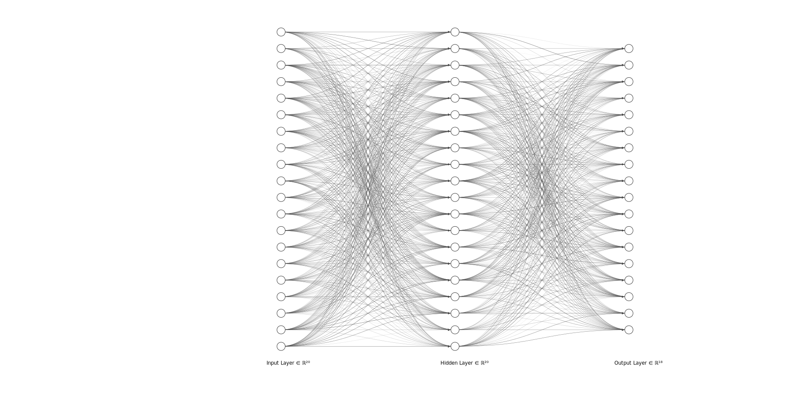

# `Seven's Game - Metal` Solution

First, identify the argument of this challenge.

```
MAXIMUM_SPIN, MAXIMUM_SEED_CHANGE, USE_JACKPOT = 1000, 1000, 1
```

It is equal to `./seven3 1000 1000 1` in the command line.

Player has to recover the model by training the game result data and win the jackpot.

## Analyzing the binary

### What does `get_random` function do?

The following is what this function does.

```
input SEED;
ARR <- int2bit(SEED);
ARR <- bit2real(SEED);
V1 <- func4(sumproduct(w1, ARR)) - 0.5;
V2 <- func4(sumproduct(w2, V1));
SEED <- bit2int(round(V2));
SEED <- 3 * SEED;
return lower 18 bits of SEED;
```

The middle part of the function is similar to a simple neural network like the following picture.



There are some additional operations into the output of the neural network such as converting the integer into bit array and multiplication. 

And note that this model does not have bias terms, so it makes training easier.

### What is `func4` function?

One can easily find out that `v` in the following code is the value of taylor series expansion of exponential function.

So the return value, `exp / (1 + exp)`, must be sigmoid function.

```
double func4(double x) {
	double v = 1;
	double w = 1;
	for(int i = 1; i <= 16; i++) {
		w = w * x / i;
		v += w;
	}
	return v / (1 + v);
}
```

If you don't realize that the `v` is the approximation of exponential function, you can guess it by checking other `func`s. They are commonly used activation functions.

### Equivalent to `get_random` in TensorFlow
The following is the representation of `get_random` function using `tf.keras`.
```
input1 = layers.Input(shape=(20,))
dense1 = layers.Dense(20, activation='sigmoid', kernel_initializer='glorot_normal', use_bias=False)
normal2 = layers.Dense(20, activation='linear')
dense2 = layers.Dense(18, activation='sigmoid', kernel_initializer='glorot_normal', use_bias=False)

m = models.Model([input1], dense2(normal2(dense1((input1)))))
normal2.set_weights([np.identity(20), np.ones(20) * (-0.5)])
normal2.trainable = False

m.compile(optimizer=tf.keras.optimizers.RMSprop(learning_rate=0.001), loss=tf.keras.losses.BinaryCrossentropy(), metrics=[tf.keras.metrics.MeanSquaredError(), tf.keras.metrics.BinaryAccuracy()])
```

## Collecting training set
Opting on the debug option in the settings, the player can see the detail result of each spin.

And the value of `get_random` function could be calculated by the debug result of spin.

### Recovering the whole input and output

Because the two most significant bits are lost when the `get_random` returns, they should be recovered for training the model.

The whole 20-bit integer is multiple of 3 and the most significant bits should be one of 00, 01 and 10. (It can not be 11.)

So one of a's in the following is the correct whole 20-bit integer.

```
val = get_random();
a[0] = val;
a[1] = (0b01 << 18) | val;
a[2] = (0b10 << 18) | val;
```

From the debug result to the true new SEED value:
```
result = list(map(lambda x: ((int(x) + 1) // 2) % 64, lines[7].decode("utf8").split("targets : ")[1].split(", symbol_count")[0].split(", ")))

seed_new = result[0] | (result[1] << 6) | (result[2] << 12)
# Because the SEED after spining is multiple of 3
if (seed_new % 3 == 0):
	seed_new = seed_new // 3
elif ((seed_new | (1 << 18)) % 3 == 0):
	seed_new = (seed_new | (1 << 18)) // 3
else:
	seed_new = (seed_new | (1 << 19)) // 3
```

### Escaping the loop
It is really easy to be stuck in the loop, and the loop easily escaped by chainging `SEED` into the new random value.

## Training the model and finding the answer
It gives higher than 98% accuracy with only `1000~2000 epochs` and the training set size of `500~800`.

Analyzing the spin result and finding the diamond position on each reel strip, we can identify which output from the model is the target.

After training the model, find the whole input space of `2**20` size.

### Why does not the model give the input SEED making the target output?
Because the model's weight values are following the normal distribution, It is highly related with the number of `1` in the bits of the output and the chance the model makes it.

For example, if the target output is `0`, it means that the model should never make `1`. But it is hard for the model to make because the weights follow the normal distribution. It is the same if the target output has too much ones.

So the best case for the higher win chance is that the target output has 8~12 ones.
