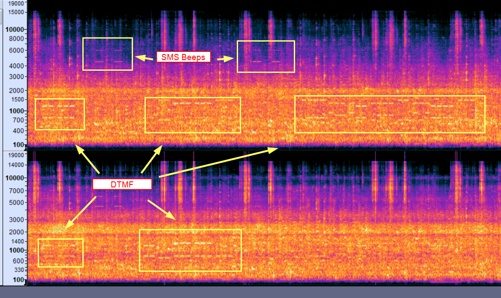
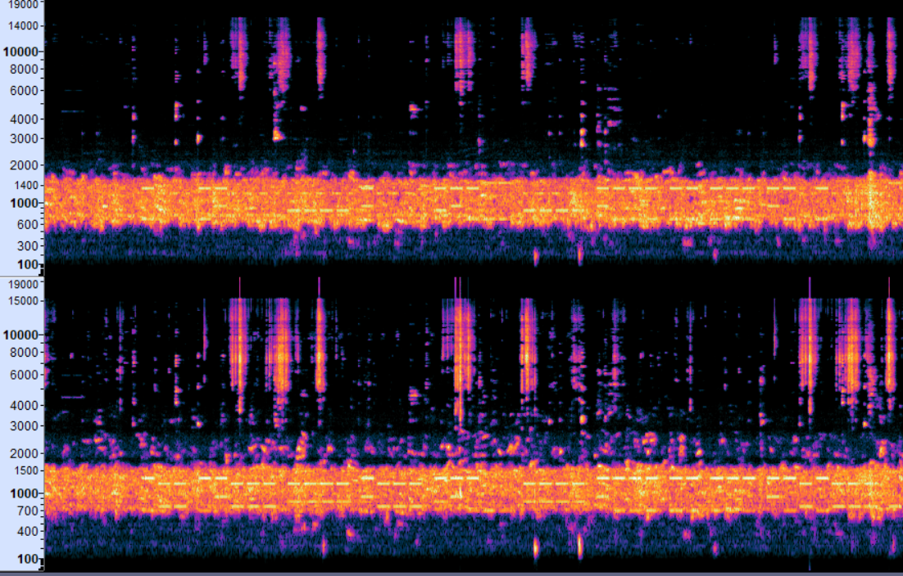

## Intro

We are given an audio file with explanation that it may have a suspicious sounds on it.
After listening a file it looks like record was done somewhere in caffee or restaurant with a lot of noise and people talking. Also mobile phone SMS sounds can be heard.

## HowTo

After Audacity application check  we can see it is stereo file. Some sounds are near the mic and some are far.
Also it is possible to recognise someone use an phone keyboard between SMS beeps.
So assuming it is about DTMF signalling used in mobile phones. 

Deeper look into the file spectrum shows us that there is a DTMF indeed. 
So we need to distinguish it from other noise.



Based on SMS beeps and DTMF signal we can assume there is some sort of conversation we need to recover. 

DTMF  - dual tone multi-frequency is the sounds or tones generated by a telephone when the numbers are pressed.
DTMF uses eight different tones. They are divided into a high and low group based on frequencies. Each key press corresponds to two tones one from the high and one from the low group.
 So lets map DTMF to phone keys:
 ```
    1: (697, 1209)  2: (697, 1336)   3: (697, 1477)
    4: (770, 1209)  5: (770, 1336)   6: (770, 1477)
    7: (852, 1209)  8: (852, 1336)   9: (852, 1477)
    *: (941, 1209)  0: (941, 1336)   #: (941, 1477)
 ```

After filtering the corresponding parts of file, changing the equlizer setting and noise reduction we can get the overal picture possible to retrieve the DTMF tone by tone. This file is not big so it is even possible to get DTMF tones manually.




So we have the signal like:
```
44-444 
beep
44-33-555-555-666
beep 
3-666-0-88-0-44-2-888-33-0-2-0-4-444-333-8
beep
2-44-2-0-444-7777-0-444-8-0-2-33-7777-0-222-22-222-0-2-4-2-444-66
beep 
999-33-7777-0-7-2-7777-7777-0-7777-77-444-88-44-9-333-444-99-8-2-777-777-9999-99-99
beep
666-55
```
This is classic Multi-Tap Phone so we can decode it easily.
for example use https://www.dcode.fr/multitap-abc-cipher

```
- hi                           - hello
- do you have a gift           - aha  is it aes cbc again
- yes  pass sqiuhwfixtarrzxx   - ok
```
So now we can decrypt the suspicious file. We have a aes cbc mentioned in SMS and pass is 16 symbols. So it should be 128 bit encryption.
The only thing we don't know lower and upper case letters in password. Since there were no special signals like * or # in audio we can assume it is lower case otherwise we need to check the upper and lower register for letters. 
```
openssl aes-128-cbc -d -in ThisIsNotASecret.enc -out ThisIsNotASecret.dec
```

And we successfully decrypted a file

***Flag is SCTF{I_ThOugHt_sp135_DR4nK_MaRtIN15}***
