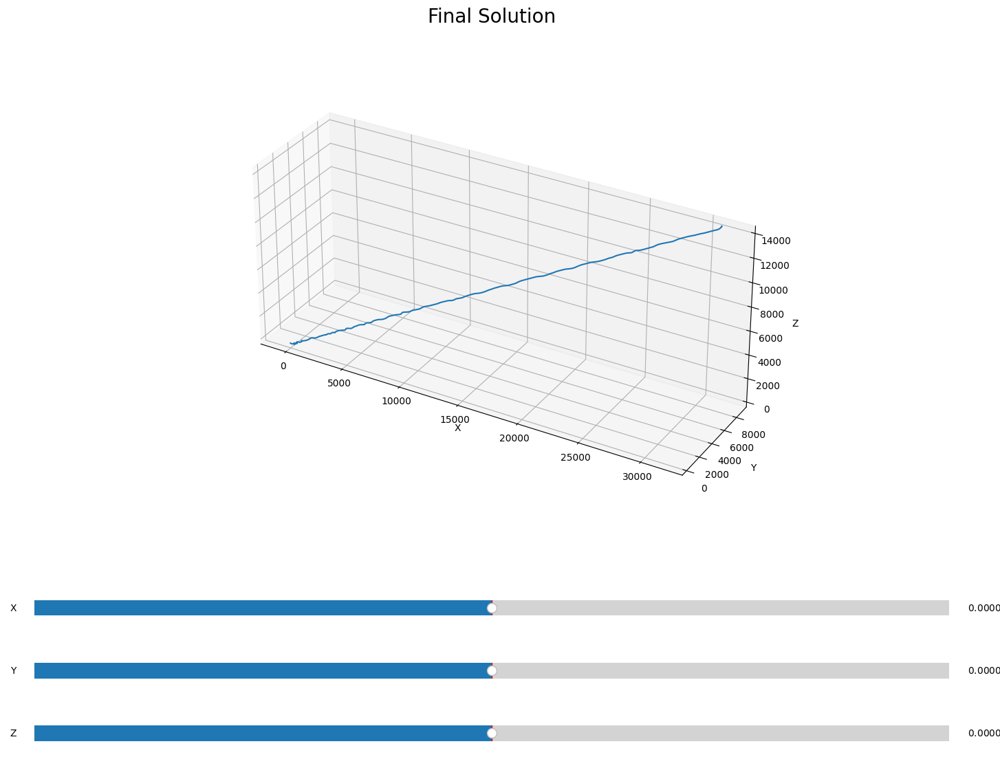

## Preambule
This task is a bit different from classic cybersecurity CTF tasks as it centers around a physics phenomenon. Still, access to inertial sensor's data can be a major vector for a number of side-channel attacks and basic understanding of what this data means will be useful.

## Input data
We are presented with data from accelerometer. As we can see, only acceleration is present, no rotation data. It might be because it was compensated before, probably using gyroscope data. So, our task is to solve *inertial navigation* problem, which means we have to simply double-integrate the acceleration data to get coordinates. Remember, velocity is *a rate of change of position*, and acceleration is *a rate of change of velocity*, so to get our coordinates from acceleration, we have do it twice.

## Solution steps
Let's plot in 3d the result using just `numpy` and `matplotlib`:
Create a quick-and-dirty plot function for 3d data, as `pyplot`'s `plot3D` parameter format is pretty annoying.
```
from mpl_toolkits.mplot3d import Axes3D
import matplotlib.pyplot as plt


def plot_3d_scatter(data, title, ax=None, call_show=True):
    if ax is None:
        fig = plt.figure()
        ax = fig.add_subplot(projection='3d')
    else:
        ax.clear()

    _ = data.T
    ax.plot3D(_[0], _[1], _[2])
    ax.set_aspect('equal')
    ax.set_xlabel('X')
    ax.set_ylabel('Y')
    ax.set_zlabel('Z')
    ax.ticklabel_format(style='plain')
    plt.title(title, size=20)

    if call_show:
        plt.show()
```

And do as we planned, blindly double-integrate our data:
```
def integrate(accels):
    velocities = np.cumsum(accels, axis=0)
    coords = np.cumsum(velocities, axis=0)
    return coords


accels = np.loadtxt('smartwatch.cap', delimiter=' ')
plot_3d_scatter(integrate(accels), 'Only Integration')
```


Huh? A perfect straight line that goes to huge values.
Time to recall that our data was recorded at some super-secret meeting, not on a space station. Unfortunate. Turns out, our acceleration data contains a constant offset from Earth's gravity, as our smartwatch was cannot distinguish between acceleration due to movement of wearer's hand and gravitational pull of the planet. And since we integrate, constant offset turns into cumulative error. Our only option is to correct it by figuring out the exact gravity vector and subtracting it from the data. We'll get our first estimation of the gravity vector by simply averaging the acceleration data:
```
gravity_from_average = np.average(accels, axis=0)
accels -= gravity_from_average
```


Looks a bit better, the values are not that huge, but still no useful data to be seen. It's hopeless to rely on just averaging to determine the gravity vector. We'll have to do some fine-tuning. Here is some less-than-beautiful code to add interactive sliders to our integration script. That would be our final solution, actually, all that is left to do is to play around with these sliders and rotate our 3d plot around to find a solution.

## Final solution
```
def main():
    accels = np.loadtxt('smartwatch.cap', delimiter=' ')

    gravity_from_average = np.average(accels, axis=0)
    accels -= gravity_from_average

    fig = plt.figure()
    gs = gridspec.GridSpec(4, 1, height_ratios=[1.0, 0.02, 0.02, 0.02])
    ax = plt.subplot(gs[0], projection='3d', title='asd')

    slider_x = Slider(ax=plt.subplot(gs[1]), label='X', valmin=-0.0005, valmax=0.0005, valinit=0, orientation='horizontal')
    slider_y = Slider(ax=plt.subplot(gs[2]), label='Y', valmin=-0.0005, valmax=0.0005, valinit=0, orientation='horizontal')
    slider_z = Slider(ax=plt.subplot(gs[3]), label='Z', valmin=-0.0005, valmax=0.0005, valinit=0, orientation='horizontal')

    callback = lambda val : plot_3d_scatter(integrate(accels - np.array([slider_x.val, slider_y.val, slider_z.val])), None, ax, False)

    slider_x.on_changed(callback)
    slider_y.on_changed(callback)
    slider_z.on_changed(callback)

    callback(None)
    plt.show()
```

The intial result is the same as previous version:


Let's play around with correction values until we recognize something resembling letters:


After some  tuning:


And here is our flag! A little hard to read, but after zooming for some time the handwriting can be recognized.

## Flag: `SCTF{F@RMING_KPI_POINTS}`

---
## P.S.
This task uses synthetic data, as with modern integrated MEMS IMU's drift-free position tracking is basically impossible for a meaningful amount of time.
