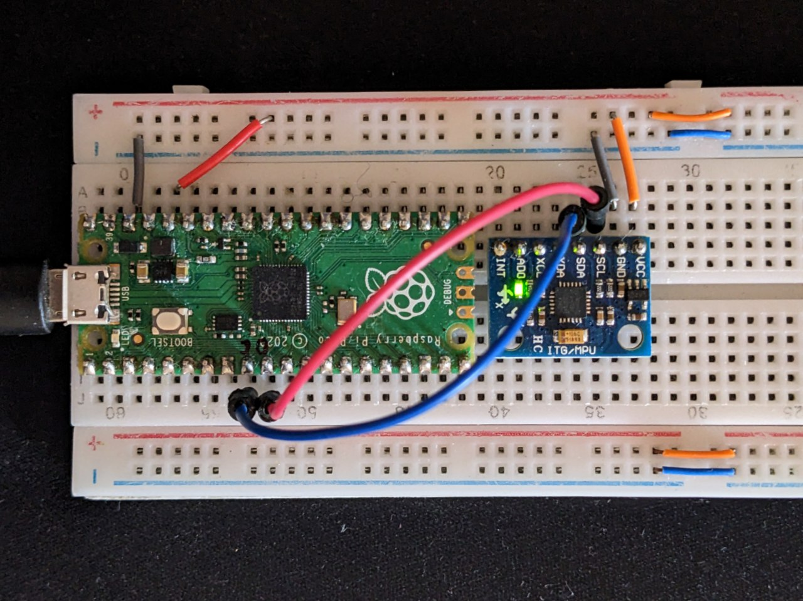

## Original coordinate data (handwtire_xxxx.csv)
Handwriting coordinates are captured from Phun physics toy

## Captures from real sensor (mpu_6050_capture_idle.cap)
These acceleration values are captured from MPU-6050 module via primitive MicroPython script.
Approximate sample rate is 227 Samples/second and doesn't really matter, since this data is only used as a reference or as a source of "realistic" sensor noise.
Use of synthetic data is **required**, because in real world, cheap MEMS IMU's drift too quickly. Measured drift was several meters in a 30-second time required to write sufficiently long CTF flag on a whiteboard.

