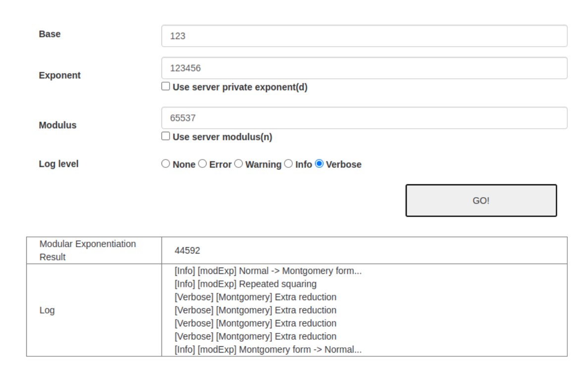

## meaas

### Description

 > I implemented a modular exponentiation server using python.
 >
 > I think my implementaion completely follows the textbook.
 >
 > http://meaas.sstf.site
 >
 > (Exploitation may take some time. Please launch your local server and make your exploit first.)

## Writeup

We can see a simple web service which calculates the modular exponentiation and its source code.

In the source code, there's naive implementaion of modular exponentiation using CRT, square-and-multiply, and montgomery multiplication algorithms.

As the treasure is `xor(sha512(d), flag)`, we have to find the server's RSA private key(d) to recover the flag.

When we put some values to test, we can see several `Extra reduction` operations from the `Verbose` log message.

Extra reduction is occured while Montgomery Multiplication, and according to a paper `Remote Timing Attacks are Practical`, P(extra reduction) is about `(c mod n) / 2R`.

By using this, we can find out the RSA `p` value bit-by-bit by controlling `c`, because we can determine which `c` is closer to `p` - not `n` but `p`, as CRT is used.

After getting `p`, we can calculate q, d, and the flag.

